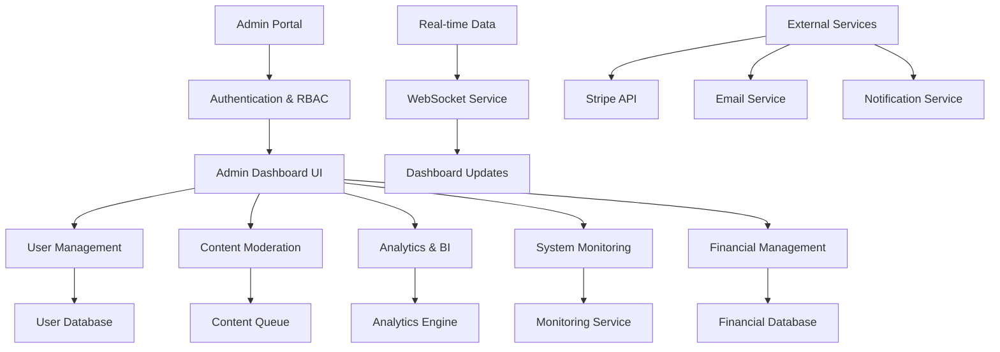
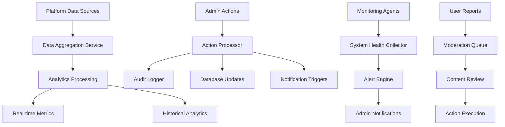

# Admin Dashboard & Platform Management Design

## Overview

The Technically Fit Admin Dashboard & Platform Management system provides a comprehensive administrative interface for managing users, monitoring platform health, moderating content, tracking business metrics, and ensuring smooth operations. The system is designed as a secure, role-based administrative portal that integrates with all existing platform components while providing real-time analytics, automated monitoring, and efficient management tools for scaling the business.

## Architecture

### Admin Dashboard Architecture



### Data Flow Architecture



## Components and Interfaces

### 1. Admin Authentication & RBAC (`$lib/admin/adminAuth.ts`)

**Purpose**: Secure admin access with role-based permissions

**Key Methods**:

```typescript
interface AdminAuthService {
  authenticateAdmin(credentials: AdminCredentials): Promise<AdminSession>;
  validateAdminPermissions(
    adminId: string,
    action: string,
    resource: string
  ): Promise<boolean>;
  createAdminUser(
    adminData: AdminUserData,
    creatorId: string
  ): Promise<AdminUser>;
  updateAdminPermissions(
    adminId: string,
    permissions: Permission[]
  ): Promise<void>;
  logAdminAction(adminId: string, action: AdminAction): Promise<void>;
  getAdminAuditLog(
    adminId: string,
    timeframe: TimeFrame
  ): Promise<AuditLogEntry[]>;
  revokeAdminAccess(adminId: string, reason: string): Promise<void>;
}
```

### 2. User Management Service (`$lib/admin/userManagementService.ts`)

**Purpose**: Comprehensive user management and support tools

**Key Methods**:

```typescript
interface UserManagementService {
  searchUsers(criteria: UserSearchCriteria): Promise<UserSearchResult[]>;
  getUserProfile(userId: string): Promise<DetailedUserProfile>;
  suspendUser(userId: string, reason: string, duration?: number): Promise<void>;
  deleteUserData(
    userId: string,
    deletionType: "soft" | "hard"
  ): Promise<DeletionResult>;
  impersonateUser(
    userId: string,
    adminId: string
  ): Promise<ImpersonationSession>;
  handleSupportRequest(
    requestId: string,
    response: SupportResponse
  ): Promise<void>;
  getUserActivityTimeline(userId: string): Promise<ActivityTimelineEntry[]>;
  bulkUserAction(
    userIds: string[],
    action: BulkUserAction
  ): Promise<BulkActionResult>;
}
```

### 3. Content Moderation Service (`$lib/admin/contentModerationService.ts`)

**Purpose**: Content review and safety management

**Key Methods**:

```typescript
interface ContentModerationService {
  getModerationQueue(
    queueType: "exercises" | "messages" | "reports"
  ): Promise<ModerationItem[]>;
  reviewContent(itemId: string, decision: ModerationDecision): Promise<void>;
  flagInappropriateContent(contentId: string, reason: string): Promise<void>;
  handleUserReport(
    reportId: string,
    investigation: Investigation
  ): Promise<void>;
  setContentPolicy(policy: ContentPolicy): Promise<void>;
  getContentAnalytics(timeframe: TimeFrame): Promise<ContentAnalytics>;
  automateContentFiltering(rules: FilteringRule[]): Promise<void>;
}
```

### 4. Analytics & Business Intelligence (`$lib/admin/analyticsService.ts`)

**Purpose**: Platform analytics and business intelligence

**Key Methods**:

```typescript
interface AnalyticsService {
  getDashboardMetrics(timeframe: TimeFrame): Promise<DashboardMetrics>;
  getUserGrowthAnalytics(period: AnalyticsPeriod): Promise<GrowthAnalytics>;
  getRevenueAnalytics(period: AnalyticsPeriod): Promise<RevenueAnalytics>;
  getEngagementMetrics(
    segmentation: UserSegmentation
  ): Promise<EngagementMetrics>;
  getConversionFunnels(funnelType: string): Promise<ConversionFunnel>;
  generateCustomReport(
    reportConfig: ReportConfiguration
  ): Promise<CustomReport>;
  exportAnalyticsData(exportConfig: ExportConfiguration): Promise<ExportResult>;
  scheduleReport(reportSchedule: ReportSchedule): Promise<void>;
}
```

### 5. System Monitoring Service (`$lib/admin/systemMonitoringService.ts`)

**Purpose**: Platform health and performance monitoring

**Key Methods**:

```typescript
interface SystemMonitoringService {
  getSystemHealth(): Promise<SystemHealthStatus>;
  getPerformanceMetrics(timeframe: TimeFrame): Promise<PerformanceMetrics>;
  getErrorLogs(
    severity: ErrorSeverity,
    limit: number
  ): Promise<ErrorLogEntry[]>;
  getResourceUtilization(): Promise<ResourceUtilization>;
  createAlert(alertConfig: AlertConfiguration): Promise<Alert>;
  handleIncident(incidentId: string, response: IncidentResponse): Promise<void>;
  getUptimeMetrics(service: string): Promise<UptimeMetrics>;
  optimizePerformance(optimizationTarget: string): Promise<OptimizationResult>;
}
```

### 6. Financial Management Service (`$lib/admin/financialManagementService.ts`)

**Purpose**: Financial operations and reporting

**Key Methods**:

```typescript
interface FinancialManagementService {
  getRevenueOverview(period: FinancialPeriod): Promise<RevenueOverview>;
  getTrainerPayouts(status: PayoutStatus): Promise<TrainerPayout[]>;
  processPayoutBatch(payoutIds: string[]): Promise<BatchPayoutResult>;
  handlePaymentDispute(
    disputeId: string,
    resolution: DisputeResolution
  ): Promise<void>;
  generateFinancialReport(
    reportType: FinancialReportType
  ): Promise<FinancialReport>;
  getTransactionLogs(
    filters: TransactionFilters
  ): Promise<TransactionLogEntry[]>;
  reconcilePayments(
    reconciliationPeriod: DateRange
  ): Promise<ReconciliationResult>;
  forecastRevenue(forecastPeriod: number): Promise<RevenueForecast>;
}
```

### 7. Trainer Management Service (`$lib/admin/trainerManagementService.ts`)

**Purpose**: Trainer verification and performance management

**Key Methods**:

```typescript
interface TrainerManagementService {
  getTrainerApplications(
    status: ApplicationStatus
  ): Promise<TrainerApplication[]>;
  verifyTrainerCredentials(
    trainerId: string,
    verification: CredentialVerification
  ): Promise<void>;
  getTrainerPerformanceMetrics(
    trainerId: string
  ): Promise<TrainerPerformanceMetrics>;
  handleTrainerDispute(
    disputeId: string,
    resolution: DisputeResolution
  ): Promise<void>;
  suspendTrainer(trainerId: string, reason: string): Promise<void>;
  getTrainerAnalytics(timeframe: TimeFrame): Promise<TrainerAnalytics>;
  promoteTopTrainers(criteria: PromotionCriteria): Promise<PromotionResult>;
}
```

## Data Models

### Admin User and Permissions

```typescript
interface AdminUser {
  id: string;
  email: string;
  name: string;
  role: AdminRole;
  permissions: Permission[];
  lastLogin: string;
  createdAt: string;
  createdBy: string;
  isActive: boolean;
  mfaEnabled: boolean;
}

interface Permission {
  resource: string; // 'users', 'content', 'analytics', 'system', 'financial'
  actions: string[]; // 'read', 'write', 'delete', 'moderate'
  conditions?: PermissionCondition[];
}

interface AdminAction {
  adminId: string;
  action: string;
  resource: string;
  resourceId?: string;
  details: any;
  timestamp: string;
  ipAddress: string;
  userAgent: string;
}
```

### User Management Models

```typescript
interface DetailedUserProfile {
  basicInfo: UserBasicInfo;
  subscriptionInfo: SubscriptionInfo;
  activityMetrics: UserActivityMetrics;
  supportHistory: SupportTicket[];
  moderationHistory: ModerationAction[];
  financialSummary: UserFinancialSummary;
  deviceConnections: DeviceConnection[];
  riskScore: number;
}

interface UserActivityMetrics {
  lastLogin: string;
  sessionCount: number;
  averageSessionDuration: number;
  featureUsage: { [feature: string]: number };
  engagementScore: number;
  retentionCohort: string;
}

interface SupportTicket {
  id: string;
  userId: string;
  subject: string;
  status: "open" | "in_progress" | "resolved" | "closed";
  priority: "low" | "medium" | "high" | "urgent";
  assignedTo?: string;
  createdAt: string;
  resolvedAt?: string;
  messages: SupportMessage[];
}
```

### Analytics and Metrics Models

```typescript
interface DashboardMetrics {
  userMetrics: {
    totalUsers: number;
    activeUsers: number;
    newUsers: number;
    churnRate: number;
  };
  revenueMetrics: {
    totalRevenue: number;
    recurringRevenue: number;
    averageRevenuePerUser: number;
    revenueGrowthRate: number;
  };
  engagementMetrics: {
    dailyActiveUsers: number;
    sessionDuration: number;
    featureAdoption: { [feature: string]: number };
    retentionRate: number;
  };
  systemMetrics: {
    uptime: number;
    responseTime: number;
    errorRate: number;
    resourceUtilization: number;
  };
}

interface ConversionFunnel {
  name: string;
  steps: FunnelStep[];
  totalUsers: number;
  conversionRate: number;
  dropoffAnalysis: DropoffAnalysis[];
}

interface FunnelStep {
  name: string;
  users: number;
  conversionRate: number;
  averageTime: number;
}
```

### Content Moderation Models

```typescript
interface ModerationItem {
  id: string;
  type: "custom_exercise" | "message" | "user_report" | "profile_content";
  content: any;
  reportedBy?: string;
  reportReason?: string;
  priority: "low" | "medium" | "high";
  status: "pending" | "under_review" | "approved" | "rejected";
  assignedTo?: string;
  createdAt: string;
  reviewedAt?: string;
}

interface ModerationDecision {
  decision: "approve" | "reject" | "modify" | "escalate";
  reason: string;
  modifications?: any;
  followUpActions?: string[];
  notifyUser: boolean;
}

interface ContentPolicy {
  type: string;
  rules: PolicyRule[];
  autoEnforcement: boolean;
  severity: "warning" | "content_removal" | "account_suspension";
}
```

### System Monitoring Models

```typescript
interface SystemHealthStatus {
  overall: "healthy" | "degraded" | "critical";
  services: ServiceHealth[];
  alerts: ActiveAlert[];
  lastUpdated: string;
}

interface ServiceHealth {
  name: string;
  status: "up" | "down" | "degraded";
  responseTime: number;
  uptime: number;
  lastCheck: string;
  dependencies: string[];
}

interface PerformanceMetrics {
  apiResponseTimes: { [endpoint: string]: number };
  databasePerformance: DatabaseMetrics;
  cacheHitRates: { [cache: string]: number };
  errorRates: { [service: string]: number };
  resourceUtilization: ResourceUtilization;
}

interface ResourceUtilization {
  cpu: number;
  memory: number;
  storage: number;
  bandwidth: number;
  databaseConnections: number;
}
```

### Financial Management Models

```typescript
interface RevenueOverview {
  totalRevenue: number;
  subscriptionRevenue: number;
  transactionRevenue: number;
  platformCommissions: number;
  trainerEarnings: number;
  refunds: number;
  chargebacks: number;
  netRevenue: number;
  revenueByPeriod: RevenueDataPoint[];
}

interface TrainerPayout {
  id: string;
  trainerId: string;
  amount: number;
  currency: string;
  status: "pending" | "processing" | "completed" | "failed";
  scheduledDate: string;
  processedDate?: string;
  transactionIds: string[];
  payoutMethod: string;
  failureReason?: string;
}

interface FinancialReport {
  reportType: string;
  period: DateRange;
  summary: FinancialSummary;
  details: FinancialDetail[];
  charts: ChartData[];
  generatedAt: string;
}
```

## Security and Access Control

### Role-Based Access Control

```typescript
enum AdminRole {
  SUPER_ADMIN = "super_admin",
  PLATFORM_ADMIN = "platform_admin",
  USER_SUPPORT = "user_support",
  CONTENT_MODERATOR = "content_moderator",
  FINANCIAL_ADMIN = "financial_admin",
  ANALYTICS_VIEWER = "analytics_viewer",
}

interface RolePermissions {
  [AdminRole.SUPER_ADMIN]: Permission[]; // All permissions
  [AdminRole.PLATFORM_ADMIN]: Permission[]; // Most permissions except financial
  [AdminRole.USER_SUPPORT]: Permission[]; // User management and support
  [AdminRole.CONTENT_MODERATOR]: Permission[]; // Content moderation only
  [AdminRole.FINANCIAL_ADMIN]: Permission[]; // Financial operations only
  [AdminRole.ANALYTICS_VIEWER]: Permission[]; // Read-only analytics
}
```

### Security Measures

- **Multi-Factor Authentication** - Required for all admin accounts
- **IP Whitelisting** - Restrict admin access to approved IP addresses
- **Session Management** - Secure session handling with timeout
- **Audit Logging** - Comprehensive logging of all admin actions
- **Data Encryption** - Encrypt sensitive admin data at rest and in transit
- **Access Reviews** - Regular review of admin permissions and access

## Performance Optimization

### Dashboard Performance

- **Real-time Updates** - WebSocket connections for live data
- **Data Caching** - Cache frequently accessed metrics and reports
- **Lazy Loading** - Load dashboard components on demand
- **Query Optimization** - Efficient database queries for analytics

### Scalability Considerations

- **Horizontal Scaling** - Design for multiple admin dashboard instances
- **Database Optimization** - Efficient indexing for admin queries
- **Background Processing** - Process heavy analytics in background
- **CDN Usage** - Serve static admin assets via CDN

## Integration Points

### Existing Platform Integration

- **User Database** - Direct access to user data and profiles
- **Convex Backend** - Real-time data synchronization
- **Payment System** - Integration with Stripe for financial data
- **Communication System** - Access to messages for moderation

### External Service Integration

- **Email Service** - Send admin notifications and reports
- **SMS Service** - Critical alerts via SMS
- **Monitoring Tools** - Integration with external monitoring services
- **Analytics Platforms** - Export data to business intelligence tools

## Monitoring and Alerting

### Admin Dashboard Monitoring

- **Usage Analytics** - Track admin dashboard usage and performance
- **Error Monitoring** - Monitor admin dashboard errors and issues
- **Performance Metrics** - Track dashboard load times and responsiveness
- **Security Monitoring** - Monitor admin access patterns and security events

### Business Alerting

- **Revenue Alerts** - Alert on significant revenue changes
- **User Growth Alerts** - Alert on unusual user growth patterns
- **System Health Alerts** - Alert on system performance issues
- **Security Alerts** - Alert on security incidents and threats

## Reporting and Documentation

### Automated Reporting

- **Daily Reports** - Automated daily business metrics reports
- **Weekly Summaries** - Weekly platform performance summaries
- **Monthly Analytics** - Comprehensive monthly business reports
- **Custom Reports** - On-demand custom report generation

### Documentation Management

- **Operational Procedures** - Document all admin procedures
- **Policy Documentation** - Maintain platform policies and guidelines
- **Change Logs** - Track all platform changes and updates
- **Incident Reports** - Document and analyze platform incidents
