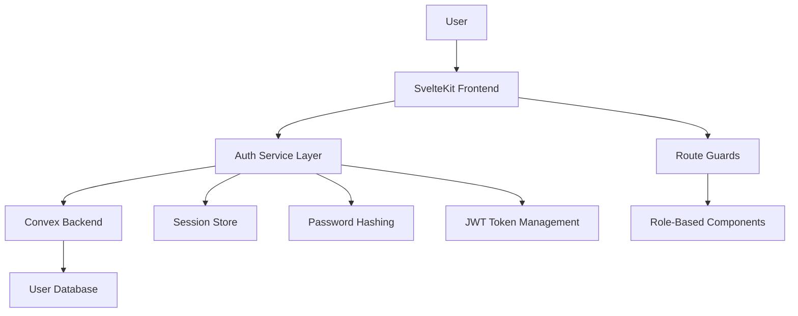
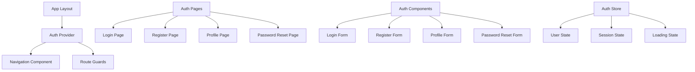

# Authentication System Design

## Overview

The Technically Fit authentication system will be built using Convex Auth (or a custom implementation) integrated with the existing Convex backend. The system will provide secure user authentication, role-based access control, and session management across the SvelteKit application. The design leverages the existing user schema and functions while adding the necessary authentication flows and UI components.

## Architecture

### Authentication Flow Architecture



### Component Architecture



## Components and Interfaces

### 1. Authentication Service (`$lib/auth/authService.ts`)

**Purpose**: Central service for all authentication operations

**Key Methods**:
```typescript
interface AuthService {
  login(email: string, password: string): Promise<AuthResult>
  register(userData: RegisterData): Promise<AuthResult>
  logout(): Promise<void>
  getCurrentUser(): Promise<User | null>
  updateProfile(updates: ProfileUpdates): Promise<User>
  resetPassword(email: string): Promise<void>
  changePassword(currentPassword: string, newPassword: string): Promise<void>
  refreshSession(): Promise<void>
}
```

### 2. Authentication Store (`$lib/stores/auth.ts`)

**Purpose**: Reactive store for authentication state management

**State Structure**:
```typescript
interface AuthState {
  user: User | null
  isAuthenticated: boolean
  isLoading: boolean
  error: string | null
  sessionExpiry: Date | null
}
```

### 3. Route Guards (`$lib/auth/guards.ts`)

**Purpose**: Protect routes based on authentication and role requirements

**Implementation**:
- `requireAuth()` - Ensures user is logged in
- `requireRole(roles: string[])` - Ensures user has required role
- `redirectIfAuthenticated()` - Redirects authenticated users away from auth pages

### 4. Authentication Pages

#### Login Page (`/auth/login`)
- Email and password inputs
- Remember me checkbox
- Forgot password link
- Registration link
- Social login options (future)

#### Registration Page (`/auth/register`)
- Basic info: email, password, name
- Role selection (client/trainer)
- Role-specific fields (conditional)
- Terms and conditions acceptance

#### Profile Page (`/profile`)
- View current profile information
- Edit profile form
- Password change section
- Account deletion option

#### Password Reset Pages (`/auth/reset-password`, `/auth/reset-password/[token]`)
- Email input for reset request
- New password form for reset completion

### 5. Authentication Components

#### AuthProvider (`$lib/components/AuthProvider.svelte`)
- Wraps the entire app
- Manages authentication state
- Handles session restoration on app load

#### LoginForm (`$lib/components/auth/LoginForm.svelte`)
- Reusable login form component
- Form validation
- Error handling
- Loading states

#### RegisterForm (`$lib/components/auth/RegisterForm.svelte`)
- Multi-step registration form
- Role-specific field rendering
- Real-time validation
- Progress indicator

## Data Models

### User Authentication Data
```typescript
interface User {
  _id: string
  email: string
  name: string
  role: 'client' | 'trainer' | 'admin'
  profileImage?: string
  isVerified: boolean
  createdAt: string
  updatedAt: string
  
  // Client-specific fields
  dateOfBirth?: string
  height?: number
  weight?: number
  fitnessLevel?: 'beginner' | 'intermediate' | 'advanced'
  goals?: string[]
  
  // Trainer-specific fields
  certifications?: string[]
  specialties?: string[]
  bio?: string
  hourlyRate?: number
  rating?: number
  totalClients?: number
}
```

### Session Data
```typescript
interface Session {
  userId: string
  token: string
  expiresAt: Date
  createdAt: Date
  lastActivity: Date
  rememberMe: boolean
}
```

### Registration Data
```typescript
interface RegisterData {
  email: string
  password: string
  name: string
  role: 'client' | 'trainer'
  
  // Conditional fields based on role
  clientData?: {
    dateOfBirth?: string
    height?: number
    weight?: number
    fitnessLevel?: 'beginner' | 'intermediate' | 'advanced'
    goals?: string[]
  }
  
  trainerData?: {
    certifications?: string[]
    specialties?: string[]
    bio?: string
    hourlyRate?: number
  }
}
```

## Error Handling

### Error Types
```typescript
enum AuthErrorType {
  INVALID_CREDENTIALS = 'invalid_credentials',
  EMAIL_ALREADY_EXISTS = 'email_already_exists',
  WEAK_PASSWORD = 'weak_password',
  SESSION_EXPIRED = 'session_expired',
  UNAUTHORIZED = 'unauthorized',
  NETWORK_ERROR = 'network_error',
  VALIDATION_ERROR = 'validation_error'
}
```

### Error Handling Strategy
1. **Client-side validation** - Immediate feedback for form inputs
2. **Server-side validation** - Comprehensive validation in Convex functions
3. **User-friendly messages** - Convert technical errors to readable messages
4. **Error logging** - Track authentication failures for security monitoring
5. **Graceful degradation** - Handle network failures and timeouts

### Error Display
- Form-level errors for validation issues
- Toast notifications for system errors
- Inline field errors for specific input problems
- Loading states during authentication operations

## Testing Strategy

### Unit Tests
- Authentication service methods
- Form validation logic
- Store state management
- Password hashing and validation

### Integration Tests
- Complete authentication flows
- Role-based access control
- Session management
- Convex function integration

### End-to-End Tests
- User registration journey
- Login/logout flows
- Password reset process
- Role-based navigation
- Profile management

### Security Tests
- Password strength validation
- Session security
- CSRF protection
- Rate limiting
- SQL injection prevention

## Security Considerations

### Password Security
- Minimum 8 characters with complexity requirements
- bcrypt hashing with salt rounds ≥ 12
- Password history to prevent reuse
- Secure password reset tokens

### Session Security
- JWT tokens with short expiration (15 minutes)
- Refresh token rotation
- Secure HTTP-only cookies
- CSRF protection tokens

### Data Protection
- Input sanitization and validation
- Rate limiting on authentication endpoints
- Account lockout after failed attempts
- Audit logging for security events

### Privacy Compliance
- Clear data collection consent
- User data deletion capabilities
- Privacy policy integration
- GDPR compliance considerations

## Performance Optimization

### Caching Strategy
- User profile data caching
- Session state persistence
- Optimistic UI updates
- Background session refresh

### Loading States
- Skeleton screens during authentication
- Progressive form loading
- Lazy loading of role-specific components
- Preloading of user dashboard data

### Network Optimization
- Request deduplication
- Retry logic for failed requests
- Offline state handling
- Connection status monitoring

## Integration Points

### Convex Backend Integration
- Utilize existing `users.js` functions
- Extend with authentication-specific mutations
- Implement session management functions
- Add password reset functionality

### SvelteKit Integration
- Server-side session validation
- Route protection middleware
- Form action handlers
- Cookie management

### UI Component Integration
- Update Navigation component with auth state
- Integrate with existing design system
- Responsive design for mobile apps
- Accessibility compliance

### Future Integrations
- Social login providers (Google, Apple)
- Two-factor authentication
- Single sign-on (SSO)
- OAuth for fitness tracker connections