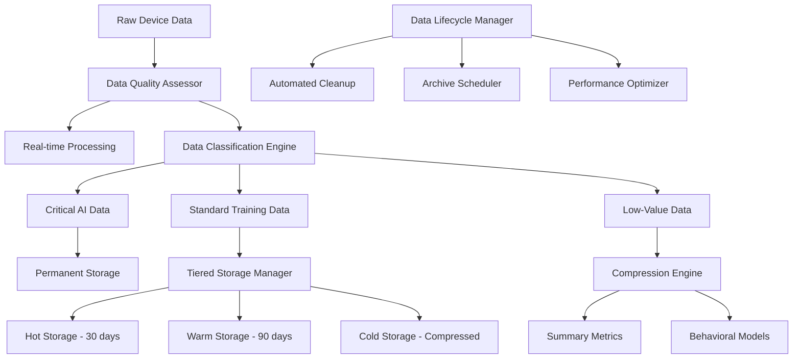
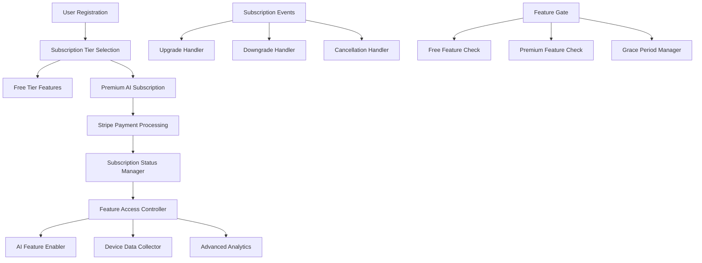

# Data Management & AI Subscription System Design

## Overview

The Technically Fit Data Management & AI Subscription System provides intelligent data lifecycle management to keep the database lean while preserving essential AI training data, combined with a subscription-based access control system for premium AI features. The system uses automated data compression, tiered storage, and intelligent retention policies to optimize costs while maintaining AI model accuracy, alongside seamless integration with the existing Stripe payment system for subscription management.

## Architecture

### Data Management Architecture



### Subscription Management Architecture



## Components and Interfaces

### 1. Data Lifecycle Manager (`$lib/data/dataLifecycleManager.ts`)

**Purpose**: Manage the complete lifecycle of user and device data

**Key Methods**:

```typescript
interface DataLifecycleManager {
  classifyDataImportance(data: any, dataType: string): Promise<DataImportance>;
  scheduleDataCompression(dataId: string, compressionDate: Date): Promise<void>;
  compressDeviceData(
    deviceData: DeviceData[],
    retentionLevel: "summary" | "behavioral"
  ): Promise<CompressedData>;
  archiveWorkoutData(
    workoutData: WorkoutData[],
    retentionDays: number
  ): Promise<ArchiveResult>;
  cleanupLowValueData(
    cutoffDate: Date,
    dataTypes: string[]
  ): Promise<CleanupResult>;
  optimizeStorage(targetReduction: number): Promise<OptimizationResult>;
  validateDataIntegrity(dataSet: string): Promise<IntegrityReport>;
}
```

### 2. AI Data Prioritizer (`$lib/data/aiDataPrioritizer.ts`)

**Purpose**: Determine which data is most valuable for AI training

**Key Methods**:

```typescript
interface AIDataPrioritizer {
  assessDataValue(data: any, aiModel: string): Promise<DataValueScore>;
  identifyCriticalTrainingData(
    dataset: any[],
    modelAccuracy: number
  ): Promise<CriticalDataSet>;
  optimizeTrainingDataset(
    fullDataset: any[],
    targetSize: number
  ): Promise<OptimizedDataset>;
  evaluateCompressionImpact(
    originalData: any[],
    compressedData: any[]
  ): Promise<AccuracyImpact>;
  selectRepresentativeSamples(
    seasonalData: any[],
    sampleSize: number
  ): Promise<RepresentativeSamples>;
  prioritizeRetention(
    dataItems: DataItem[],
    storageLimit: number
  ): Promise<RetentionPlan>;
  updatePriorities(modelPerformance: ModelPerformance): Promise<void>;
}
```

### 3. Subscription Manager (`$lib/subscription/subscriptionManager.ts`)

**Purpose**: Handle all subscription-related operations and feature access

**Key Methods**:

```typescript
interface SubscriptionManager {
  createSubscription(
    userId: string,
    planId: string,
    paymentMethodId: string
  ): Promise<Subscription>;
  upgradeSubscription(
    userId: string,
    newPlanId: string
  ): Promise<SubscriptionChange>;
  downgradeSubscription(
    userId: string,
    newPlanId: string,
    effectiveDate?: Date
  ): Promise<SubscriptionChange>;
  cancelSubscription(
    userId: string,
    cancelAtPeriodEnd: boolean
  ): Promise<CancellationResult>;
  checkFeatureAccess(
    userId: string,
    featureName: string
  ): Promise<AccessResult>;
  handlePaymentFailure(subscriptionId: string): Promise<PaymentFailureResult>;
  processSubscriptionWebhook(webhookEvent: StripeWebhookEvent): Promise<void>;
}
```

### 4. Feature Access Controller (`$lib/subscription/featureAccessController.ts`)

**Purpose**: Control access to features based on subscription status

**Key Methods**:

```typescript
interface FeatureAccessController {
  validateAccess(userId: string, feature: AIFeature): Promise<AccessValidation>;
  enableAIFeatures(userId: string): Promise<void>;
  disableAIFeatures(userId: string, gracePeriod?: number): Promise<void>;
  getAvailableFeatures(
    subscriptionTier: SubscriptionTier
  ): Promise<FeatureList>;
  handleFeatureRequest(
    userId: string,
    featureRequest: FeatureRequest
  ): Promise<FeatureResponse>;
  manageGracePeriod(
    userId: string,
    gracePeriodDays: number
  ): Promise<GracePeriodResult>;
  logFeatureUsage(
    userId: string,
    feature: string,
    usage: FeatureUsage
  ): Promise<void>;
}
```

### 5. Data Compression Engine (`$lib/data/dataCompressionEngine.ts`)

**Purpose**: Compress and summarize data while preserving AI training value

**Key Methods**:

```typescript
interface DataCompressionEngine {
  compressDeviceMetrics(
    rawData: DeviceData[],
    compressionLevel: CompressionLevel
  ): Promise<CompressedMetrics>;
  createBehavioralSummary(
    userActions: UserAction[],
    timeframe: TimeFrame
  ): Promise<BehavioralSummary>;
  generatePerformanceSummary(
    workoutData: WorkoutData[]
  ): Promise<PerformanceSummary>;
  compressRIRData(
    rirHistory: RIRDataPoint[],
    accuracyThreshold: number
  ): Promise<CompressedRIRData>;
  createSeasonalPatterns(
    timeSeriesData: TimeSeriesData[]
  ): Promise<SeasonalPatterns>;
  validateCompressionQuality(
    original: any[],
    compressed: any[]
  ): Promise<CompressionQuality>;
  decompressForAnalysis(
    compressedData: CompressedData,
    analysisType: string
  ): Promise<AnalysisData>;
}
```

## Data Models

### Data Classification and Retention

```typescript
interface DataImportance {
  dataId: string;
  importance: "critical" | "high" | "medium" | "low";
  retentionPeriod: number; // days
  compressionEligible: boolean;
  aiTrainingValue: number; // 0-1 score
  storageOptimization: "none" | "compress" | "summarize" | "delete";
  lastAccessed: string;
  accessFrequency: number;
}

interface DataRetentionPolicy {
  dataType: string;
  criticalRetentionDays: number;
  standardRetentionDays: number;
  compressionThresholdDays: number;
  deletionThresholdDays: number;
  aiValueThreshold: number;
  qualityThreshold: number;
  exceptions: RetentionException[];
}

interface CompressedData {
  originalDataId: string;
  compressionType: "summary" | "behavioral" | "statistical";
  compressedAt: string;
  originalSize: number;
  compressedSize: number;
  compressionRatio: number;
  aiValueRetained: number; // percentage
  summaryMetrics: SummaryMetrics;
  retrievalInstructions: RetrievalInstructions;
}
```

### Subscription and Feature Access

```typescript
interface AISubscription {
  id: string;
  userId: string;
  planId: string;
  status: "active" | "canceled" | "past_due" | "unpaid" | "trialing";
  currentPeriodStart: string;
  currentPeriodEnd: string;
  cancelAtPeriodEnd: boolean;
  trialEnd?: string;
  stripeSubscriptionId: string;
  features: AIFeature[];
  usage: SubscriptionUsage;
  createdAt: string;
  updatedAt: string;
}

interface AIFeature {
  name: string;
  enabled: boolean;
  usageLimit?: number;
  currentUsage: number;
  resetPeriod: "daily" | "weekly" | "monthly";
  lastReset: string;
  gracePeriodEnd?: string;
}

interface SubscriptionTier {
  id: string;
  name: string;
  price: number;
  currency: string;
  interval: "month" | "year";
  features: {
    deviceIntegration: boolean;
    rirPredictions: boolean;
    realtimeAdaptations: boolean;
    advancedAnalytics: boolean;
    prioritySupport: boolean;
    dataRetentionExtended: boolean;
  };
  limits: {
    deviceConnections: number;
    dataRetentionDays: number;
    aiPredictionsPerMonth: number;
    advancedReportsPerMonth: number;
  };
}
```

### Data Storage Optimization

```typescript
interface StorageMetrics {
  totalStorageUsed: number; // bytes
  storageByType: { [dataType: string]: number };
  compressionSavings: number;
  deletionSavings: number;
  projectedGrowth: number;
  optimizationOpportunities: OptimizationOpportunity[];
  costAnalysis: StorageCostAnalysis;
}

interface TieredStorage {
  hotStorage: {
    data: any[];
    maxAge: number; // days
    accessFrequency: "high";
    cost: number;
  };
  warmStorage: {
    data: any[];
    maxAge: number; // days
    accessFrequency: "medium";
    cost: number;
  };
  coldStorage: {
    data: CompressedData[];
    accessFrequency: "low";
    cost: number;
    retrievalTime: number; // seconds
  };
}
```

## Error Handling and Fallbacks

### Data Management Errors

```typescript
enum DataManagementError {
  COMPRESSION_FAILED = "compression_failed",
  INTEGRITY_VIOLATION = "integrity_violation",
  STORAGE_LIMIT_EXCEEDED = "storage_limit_exceeded",
  CRITICAL_DATA_LOSS = "critical_data_loss",
  ARCHIVE_CORRUPTION = "archive_corruption",
  RETRIEVAL_TIMEOUT = "retrieval_timeout",
}
```

### Subscription Errors

```typescript
enum SubscriptionError {
  PAYMENT_FAILED = "payment_failed",
  SUBSCRIPTION_EXPIRED = "subscription_expired",
  FEATURE_ACCESS_DENIED = "feature_access_denied",
  UPGRADE_FAILED = "upgrade_failed",
  DOWNGRADE_FAILED = "downgrade_failed",
  WEBHOOK_PROCESSING_ERROR = "webhook_processing_error",
}
```

### Error Handling Strategy

1. **Data Loss Prevention** - Multiple validation layers before any deletion
2. **Graceful Degradation** - Fallback to cached data when retrieval fails
3. **Subscription Continuity** - Grace periods for payment failures
4. **Feature Fallbacks** - Basic features when premium features fail
5. **Audit Logging** - Complete audit trail for all data operations

## Performance Optimization

### Data Access Optimization

- **Intelligent Caching** - Frequently accessed data cached in memory
- **Predictive Loading** - Pre-load data likely to be needed
- **Query Optimization** - Efficient database queries with proper indexing
- **Compression Algorithms** - Fast compression that preserves AI value

### Subscription Performance

- **Feature Cache** - Cache subscription status and feature access
- **Webhook Processing** - Asynchronous processing of subscription events
- **Access Validation** - Fast feature access checks with minimal database queries
- **Usage Tracking** - Efficient tracking of feature usage and limits

### Storage Performance

- **Tiered Storage** - Automatic data movement between storage tiers
- **Background Processing** - Data compression and cleanup in background
- **Batch Operations** - Process multiple data operations together
- **Storage Monitoring** - Real-time monitoring of storage usage and performance

## Security and Privacy

### Data Protection

- **Encryption at Rest** - All stored data encrypted with strong algorithms
- **Encryption in Transit** - All data transfers encrypted with TLS
- **Access Controls** - Role-based access to data management functions
- **Audit Logging** - Complete audit trail for all data operations

### Privacy Compliance

- **Data Minimization** - Only collect and retain necessary data
- **User Consent** - Clear consent for AI data usage and retention
- **Right to Deletion** - Users can request deletion of their data
- **Data Portability** - Users can export their data in standard formats

### Subscription Security

- **Payment Security** - PCI DSS compliant payment processing
- **Subscription Validation** - Secure validation of subscription status
- **Feature Access Security** - Secure enforcement of feature access controls
- **Fraud Prevention** - Monitor for subscription fraud and abuse

## Integration Points

### Convex Backend Integration

- **Schema Extension** - Add subscription and data management tables
- **Real-time Updates** - Real-time subscription status updates
- **Data Queries** - Optimized queries for compressed and archived data
- **Webhook Handling** - Process Stripe webhooks for subscription changes

### Stripe Integration

- **Subscription Management** - Create, update, and cancel subscriptions
- **Payment Processing** - Handle subscription payments and failures
- **Webhook Processing** - Process subscription lifecycle events
- **Invoice Management** - Generate and manage subscription invoices

### AI System Integration

- **Data Feeding** - Provide optimized data to AI training systems
- **Feature Gating** - Control AI feature access based on subscription
- **Usage Tracking** - Track AI feature usage for billing and limits
- **Performance Monitoring** - Monitor AI performance with compressed data

## Monitoring and Analytics

### Data Management Metrics

- **Storage Usage** - Track storage usage by type and user
- **Compression Ratios** - Monitor compression effectiveness
- **Data Quality** - Track data quality scores over time
- **Access Patterns** - Monitor data access patterns for optimization

### Subscription Metrics

- **Subscription Growth** - Track subscription signups and cancellations
- **Feature Usage** - Monitor usage of premium AI features
- **Revenue Analytics** - Track subscription revenue and trends
- **Churn Analysis** - Analyze subscription cancellation patterns

### Performance Metrics

- **Query Performance** - Monitor database query performance
- **Compression Performance** - Track compression speed and effectiveness
- **Feature Access Speed** - Monitor feature access validation speed
- **System Health** - Overall system health and performance monitoring
