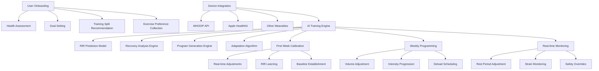
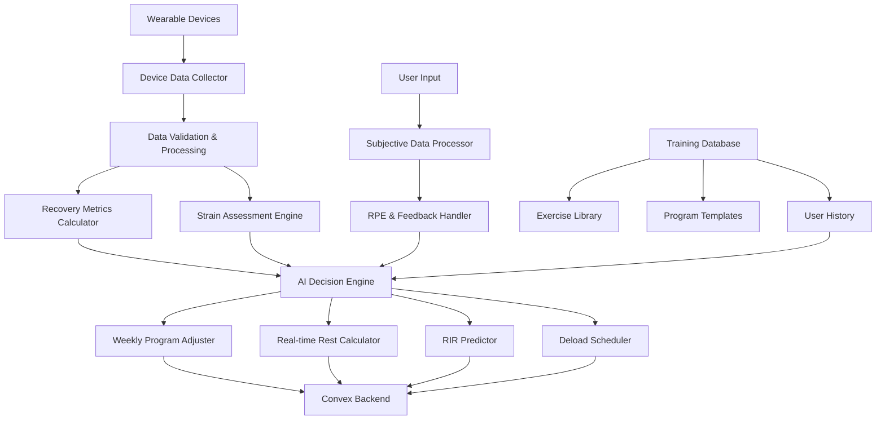

# Intelligent Training System Design

## Overview

The Technically Fit Intelligent Training System is an AI-powered training platform that provides personalized onboarding, adaptive workout generation, and data-driven program adjustments. The system leverages wearable device data (WHOOP, Apple Watch, etc.) as the primary foundation for all training adaptations, with a sophisticated first-week calibration period to establish RIR (Reps in Reserve) predictions, followed by device-based weekly program adjustments and limited real-time rest period modifications.

## Architecture

### Intelligent Training System Architecture



### Data Flow Architecture



## Components and Interfaces

### 1. Onboarding Engine (`$lib/training/onboardingEngine.ts`)

**Purpose**: Comprehensive user assessment and initial program generation

**Key Methods**:
```typescript
interface OnboardingEngine {
  collectUserBasics(age: number, height: number, weight: number, sex: string): Promise<UserProfile>
  assessFitnessBackground(experience: string, activity: string, frequency: number): Promise<FitnessAssessment>
  screenMedicalConditions(conditions: MedicalCondition[]): Promise<MedicalScreening>
  identifyGoals(primaryGoals: string[], timeline: number): Promise<GoalProfile>
  assessAvailability(days: number[], duration: number, constraints: string[]): Promise<AvailabilityProfile>
  recommendTrainingSplit(profile: CompleteProfile): Promise<TrainingSplitRecommendation[]>
  collectExercisePreferences(muscleGroups: string[]): Promise<ExercisePreferences>
  generateInitialProgram(profile: CompleteProfile, split: TrainingSplit): Promise<TrainingProgram>
}
```

### 2. Device Data Collector (`$lib/training/deviceDataCollector.ts`)

**Purpose**: Integrate and process data from multiple wearable devices

**Key Methods**:
```typescript
interface DeviceDataCollector {
  connectDevice(deviceType: 'whoop' | 'apple_watch' | 'garmin' | 'fitbit'): Promise<DeviceConnection>
  collectRealtimeData(deviceId: string): Promise<RealtimeMetrics>
  getRecoveryMetrics(userId: string, dateRange: DateRange): Promise<RecoveryData[]>
  getStrainData(userId: string, workoutId: string): Promise<StrainMetrics>
  getSleepData(userId: string, date: string): Promise<SleepMetrics>
  getHRVBaseline(userId: string): Promise<HRVBaseline>
  validateDataQuality(data: DeviceData): DataQualityScore
  handleDeviceDisconnection(deviceId: string): Promise<void>
}
```

### 3. AI Training Engine (`$lib/training/aiTrainingEngine.ts`)

**Purpose**: Core AI decision-making for all training adaptations

**Key Methods**:
```typescript
interface AITrainingEngine {
  analyzeWeeklyPerformance(userId: string, weekData: WeeklyData): Promise<PerformanceAnalysis>
  calculateProgramAdjustments(analysis: PerformanceAnalysis, currentProgram: TrainingProgram): Promise<ProgramAdjustments>
  predictRIR(userId: string, exercise: Exercise, setNumber: number): Promise<RIRPrediction>
  assessRecoveryStatus(recoveryData: RecoveryData[]): Promise<RecoveryStatus>
  determineDeloadTiming(userId: string, currentWeek: number, recoveryTrend: RecoveryTrend): Promise<DeloadRecommendation>
  calculateRestAdjustment(realtimeStrain: StrainMetrics, baseRestTime: number): Promise<RestAdjustment>
  generateSafetyOverride(dangerSignals: SafetySignal[]): Promise<SafetyOverride>
}
```

### 4. RIR Prediction Model (`$lib/training/rirPredictor.ts`)

**Purpose**: Learn and predict Reps in Reserve for each user and exercise

**Key Methods**:
```typescript
interface RIRPredictor {
  initializeUserModel(userId: string, exerciseId: string): Promise<RIRModel>
  recordActualPerformance(userId: string, exerciseId: string, predicted: number, actual: number): Promise<void>
  updatePredictionModel(userId: string, exerciseId: string, performanceData: PerformanceData[]): Promise<RIRModel>
  predictRepsInReserve(userId: string, exerciseId: string, setNumber: number, currentStrain: number): Promise<RIRPrediction>
  getModelAccuracy(userId: string, exerciseId: string): Promise<AccuracyMetrics>
  calibrateForNewExercise(userId: string, exerciseId: string, similarExercises: string[]): Promise<RIRModel>
  exportUserModel(userId: string): Promise<UserRIRModel>
}
```

### 5. Weekly Program Adjuster (`$lib/training/weeklyProgramAdjuster.ts`)

**Purpose**: Adjust training parameters week-over-week based on device data

**Key Methods**:
```typescript
interface WeeklyProgramAdjuster {
  analyzeWeeklyRecovery(userId: string, weekData: WeeklyRecoveryData): Promise<RecoveryAnalysis>
  calculateVolumeAdjustments(recoveryAnalysis: RecoveryAnalysis, currentVolume: VolumeMetrics): Promise<VolumeAdjustments>
  adjustIntensityProgression(strengthGains: StrengthData[], recoveryCapacity: number): Promise<IntensityAdjustments>
  scheduleDeloadWeek(currentWeek: number, recoveryTrend: RecoveryTrend, userPreference?: number): Promise<DeloadSchedule>
  generateNextWeekProgram(currentProgram: TrainingProgram, adjustments: ProgramAdjustments): Promise<TrainingProgram>
  validateAdjustments(proposedChanges: ProgramAdjustments, safetyLimits: SafetyLimits): Promise<ValidationResult>
  trackProgressionRate(userId: string, timeframe: number): Promise<ProgressionMetrics>
}
```

### 6. Real-time Workout Monitor (`$lib/training/realtimeWorkoutMonitor.ts`)

**Purpose**: Monitor workouts and make limited real-time adjustments

**Key Methods**:
```typescript
interface RealtimeWorkoutMonitor {
  startWorkoutMonitoring(userId: string, workoutId: string): Promise<MonitoringSession>
  trackRealtimeStrain(deviceData: RealtimeDeviceData): Promise<StrainAssessment>
  calculateRestAdjustment(currentStrain: StrainAssessment, baseRest: number): Promise<RestRecommendation>
  monitorSafetySignals(deviceData: RealtimeDeviceData, userFeedback: SubjectiveFeedback): Promise<SafetyStatus>
  recordSetPerformance(setData: SetPerformanceData): Promise<void>
  endWorkoutMonitoring(sessionId: string): Promise<WorkoutSummary>
  handleEmergencyStop(sessionId: string, reason: string): Promise<void>
}
```

## Data Models

### User Profile and Assessment
```typescript
interface CompleteUserProfile {
  userId: string
  basics: {
    age: number
    height: number // cm
    weight: number // kg
    biologicalSex: 'male' | 'female'
  }
  fitnessBackground: {
    experienceLevel: 'beginner' | 'intermediate' | 'advanced'
    currentActivityLevel: 'sedentary' | 'lightly_active' | 'moderately_active' | 'very_active'
    trainingFrequency: number // days per week
    previousInjuries: string[]
  }
  medicalScreening: {
    conditions: MedicalCondition[]
    medications: string[]
    restrictions: ExerciseRestriction[]
    clearanceRequired: boolean
  }
  goals: {
    primary: 'strength' | 'muscle_gain' | 'fat_loss' | 'endurance' | 'general_fitness'
    secondary: string[]
    timeline: number // weeks
    specificTargets: GoalTarget[]
  }
  availability: {
    trainingDays: number[]
    sessionDuration: number // minutes
    timeConstraints: string[]
    equipmentAccess: string[]
  }
  exercisePreferences: {
    favorites: string[]
    dislikes: string[]
    modifications: ExerciseModification[]
  }
}
```

### Device Data Models
```typescript
interface DeviceData {
  deviceId: string
  deviceType: 'whoop' | 'apple_watch' | 'garmin' | 'fitbit' | 'polar'
  timestamp: string
  metrics: {
    heartRate?: number
    hrv?: number
    strain?: number
    recovery?: number
    sleepScore?: number
    restingHeartRate?: number
    calories?: number
    steps?: number
  }
  quality: DataQualityScore
  batteryLevel?: number
  connectionStatus: 'connected' | 'disconnected' | 'syncing'
}

interface RecoveryData {
  userId: string
  date: string
  recoveryScore: number // 0-100
  hrvScore: number
  restingHeartRate: number
  sleepPerformance: number
  strainYesterday: number
  baselineDeviation: number
  trend: 'improving' | 'stable' | 'declining'
  deviceSource: string
}
```

### RIR Prediction Models
```typescript
interface RIRModel {
  userId: string
  exerciseId: string
  modelVersion: string
  accuracy: number // 0-1
  trainingData: RIRTrainingPoint[]
  parameters: {
    baselineRIR: number
    fatigueRate: number
    strainSensitivity: number
    experienceModifier: number
  }
  lastUpdated: string
  predictionCount: number
  validationMetrics: ModelValidationMetrics
}

interface RIRPrediction {
  predictedRIR: number
  confidence: number // 0-1
  factors: {
    setNumber: number
    currentStrain: number
    recoveryStatus: number
    historicalPerformance: number
  }
  recommendation: 'conservative' | 'moderate' | 'aggressive'
  safetyMargin: number
}
```

### Training Program Models
```typescript
interface TrainingProgram {
  id: string
  userId: string
  programType: 'ppl' | 'full_body' | 'upper_lower' | 'bro_split'
  currentWeek: number
  totalWeeks: number
  deloadWeeks: number[]
  workouts: Workout[]
  progressionScheme: ProgressionScheme
  adaptationHistory: AdaptationRecord[]
  createdAt: string
  lastModified: string
}

interface Workout {
  id: string
  name: string
  dayOfWeek: number
  exercises: Exercise[]
  estimatedDuration: number
  targetMuscleGroups: string[]
  intensity: 'light' | 'moderate' | 'high'
  volume: VolumeMetrics
}

interface Exercise {
  id: string
  name: string
  sets: number
  reps: RepRange
  weight: WeightProgression
  restTime: number // seconds
  rirTarget: number
  notes: string[]
  alternatives: string[]
  progressionHistory: ProgressionPoint[]
}
```

### Weekly Adjustment Models
```typescript
interface WeeklyAdjustments {
  userId: string
  weekNumber: number
  adjustmentType: 'progression' | 'maintenance' | 'deload' | 'recovery'
  volumeChanges: {
    setsMultiplier: number // e.g., 1.1 for 10% increase
    repsAdjustment: number
    exerciseAdditions: string[]
    exerciseRemovals: string[]
  }
  intensityChanges: {
    weightProgression: number // percentage increase
    rirAdjustment: number
    restTimeModification: number
  }
  reasoning: {
    recoveryScore: number
    performanceMetrics: PerformanceMetrics
    deviceDataSummary: DeviceDataSummary
    userFeedback: SubjectiveFeedback
  }
  appliedAt: string
  userAccepted: boolean
}

interface DeloadSchedule {
  userId: string
  blockNumber: number
  originalDeloadWeek: number
  adjustedDeloadWeek?: number
  reason: 'scheduled' | 'recovery_based' | 'user_requested'
  deloadParameters: {
    volumeReduction: number // percentage
    intensityReduction: number // percentage
    exerciseModifications: ExerciseModification[]
  }
  recoveryMetrics: RecoveryData[]
  scheduledAt: string
  completedAt?: string
}
```

## Error Handling and Safety

### Safety Override System
```typescript
interface SafetyOverride {
  triggerId: string
  userId: string
  workoutId: string
  triggerType: 'heart_rate' | 'strain' | 'user_report' | 'device_alert'
  severity: 'warning' | 'caution' | 'emergency'
  action: 'extend_rest' | 'reduce_intensity' | 'end_workout' | 'seek_medical'
  deviceData: DeviceData
  userResponse: string
  overrideApplied: boolean
  timestamp: string
}
```

### Error Handling Strategy
1. **Device Disconnection** - Graceful fallback to user input and conservative programming
2. **Data Quality Issues** - Validation and filtering of unreliable device data
3. **Model Prediction Failures** - Fallback to conservative RIR estimates
4. **Safety Concerns** - Immediate override of normal programming limitations
5. **User Disagreement** - Allow user override with safety warnings

## Performance Optimization

### Caching Strategy
- **Device Data Cache** - Recent metrics cached locally for offline access
- **RIR Model Cache** - User-specific models cached for fast predictions
- **Program Cache** - Current and next week programs cached locally
- **Exercise Database Cache** - Frequently used exercises cached

### Real-time Processing
- **Streaming Device Data** - Real-time processing of heart rate and strain
- **Efficient RIR Calculations** - Optimized algorithms for fast predictions
- **Background Sync** - Device data synced in background
- **Predictive Loading** - Pre-load likely needed data

### Machine Learning Optimization
- **Model Compression** - Lightweight models for mobile deployment
- **Incremental Learning** - Models update with new data without full retraining
- **Edge Computing** - Critical calculations performed locally
- **Batch Processing** - Weekly adjustments processed in batches

## Integration Points

### Convex Backend Integration
- **Training Programs** - Stored in existing program structure
- **User Profiles** - Extended user schema with training data
- **Device Integration** - Leverage existing WHOOP and fitness tracker connections
- **Progress Tracking** - Integration with existing workout logging

### Wearable Device APIs
- **WHOOP API** - Primary source for strain and recovery data
- **Apple HealthKit** - iOS device integration for comprehensive health data
- **Google Fit** - Android device integration
- **Garmin Connect** - Advanced training metrics
- **Fitbit API** - Heart rate and activity data

### Mobile App Integration
- **Native Notifications** - Real-time alerts for rest adjustments and safety
- **Background Processing** - Continuous device data collection
- **Offline Functionality** - Core features work without internet
- **Camera Integration** - Form analysis for exercise technique (future)

## Security and Privacy

### Data Protection
- **Device Data Encryption** - All physiological data encrypted at rest
- **Secure API Connections** - Encrypted connections to all device APIs
- **User Consent Management** - Granular control over data sharing
- **Data Retention Policies** - Automatic cleanup of old device data

### Health Data Compliance
- **HIPAA Considerations** - Health data handling best practices
- **GDPR Compliance** - European privacy regulation compliance
- **Device API Terms** - Compliance with all wearable device API terms
- **Medical Disclaimers** - Clear limitations and medical advice disclaimers

## Testing Strategy

### AI Model Testing
- **RIR Prediction Accuracy** - Continuous validation against actual performance
- **Recovery Model Validation** - Correlation with subjective recovery reports
- **Safety System Testing** - Simulation of dangerous scenarios
- **Edge Case Handling** - Testing with unusual device data patterns

### Device Integration Testing
- **Multi-device Scenarios** - Testing with multiple connected devices
- **Connection Reliability** - Testing device disconnection and reconnection
- **Data Quality Validation** - Testing with poor quality device data
- **Battery Impact Testing** - Monitoring app impact on device battery

### User Experience Testing
- **Onboarding Flow** - Complete user journey testing
- **Real-time Responsiveness** - Testing real-time adjustment speed
- **Offline Functionality** - Testing without device connectivity
- **Accessibility** - Testing with various user abilities and limitations