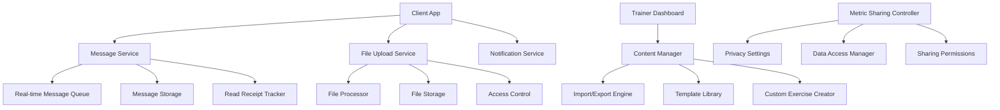
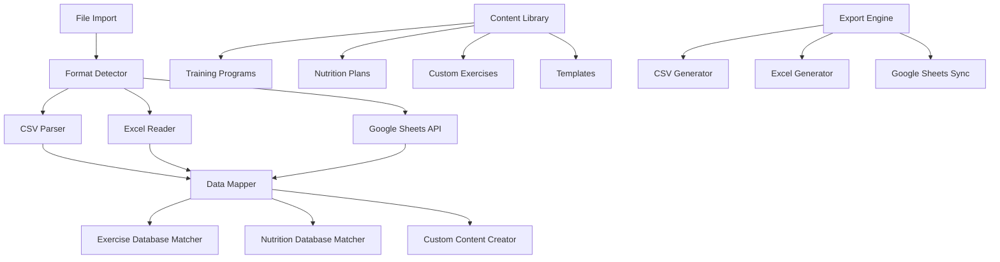

# Lean Communication & Content Management System Design

## Overview

The Technically Fit Lean Communication & Content Management System provides cost-effective trainer-client communication through text-based messaging, efficient content import/export capabilities for training and nutrition plans, custom exercise creation for premium users, and granular metric sharing controls. The system is designed to minimize infrastructure costs while maximizing functionality through smart file processing, selective data sharing, and seamless integration with existing platform features.

## Architecture

### Communication System Architecture



### Content Management Architecture



## Components and Interfaces

### 1. Message Service (`$lib/communication/messageService.ts`)

**Purpose**: Handle all text-based communication between trainers and clients

**Key Methods**:

```typescript
interface MessageService {
  sendMessage(
    senderId: string,
    receiverId: string,
    content: string,
    attachments?: File[]
  ): Promise<Message>;
  getConversation(
    userId1: string,
    userId2: string,
    limit?: number
  ): Promise<Message[]>;
  markAsRead(messageId: string, userId: string): Promise<void>;
  searchMessages(
    userId: string,
    query: string,
    conversationId?: string
  ): Promise<Message[]>;
  deleteMessage(messageId: string, userId: string): Promise<void>;
  reportMessage(
    messageId: string,
    reporterId: string,
    reason: string
  ): Promise<void>;
  getUnreadCount(userId: string): Promise<number>;
}
```

### 2. File Import/Export Engine (`$lib/content/importExportEngine.ts`)

**Purpose**: Process CSV, Excel, and Google Sheets for training and nutrition plans

**Key Methods**:

```typescript
interface ImportExportEngine {
  importTrainingPlan(file: File, trainerId: string): Promise<ImportResult>;
  importNutritionPlan(file: File, trainerId: string): Promise<ImportResult>;
  exportTrainingPlan(
    programId: string,
    format: "csv" | "excel" | "sheets"
  ): Promise<ExportResult>;
  exportNutritionPlan(
    planId: string,
    format: "csv" | "excel" | "sheets"
  ): Promise<ExportResult>;
  validateImportData(
    data: any[],
    type: "training" | "nutrition"
  ): Promise<ValidationResult>;
  mapExercisesToDatabase(exercises: string[]): Promise<ExerciseMapping[]>;
  mapFoodsToDatabase(foods: string[]): Promise<FoodMapping[]>;
  syncGoogleSheet(sheetId: string, trainerId: string): Promise<SyncResult>;
}
```

### 3. Custom Exercise Creator (`$lib/content/customExerciseCreator.ts`)

**Purpose**: Allow paid members and trainers to create custom exercises

**Key Methods**:

```typescript
interface CustomExerciseCreator {
  createCustomExercise(
    userId: string,
    exerciseData: CustomExerciseData
  ): Promise<CustomExercise>;
  updateCustomExercise(
    exerciseId: string,
    updates: Partial<CustomExerciseData>
  ): Promise<CustomExercise>;
  deleteCustomExercise(exerciseId: string, userId: string): Promise<void>;
  shareExerciseWithClient(exerciseId: string, clientId: string): Promise<void>;
  makeExercisePublic(exerciseId: string, trainerId: string): Promise<void>;
  searchCustomExercises(
    userId: string,
    filters: ExerciseFilters
  ): Promise<CustomExercise[]>;
  validateExerciseData(
    exerciseData: CustomExerciseData
  ): Promise<ValidationResult>;
}
```

### 4. Metric Sharing Controller (`$lib/communication/metricSharingController.ts`)

**Purpose**: Manage granular sharing of user metrics with trainers

**Key Methods**:

```typescript
interface MetricSharingController {
  updateSharingPermissions(
    userId: string,
    trainerId: string,
    permissions: SharingPermissions
  ): Promise<void>;
  requestDataAccess(
    trainerId: string,
    clientId: string,
    requestedMetrics: string[]
  ): Promise<AccessRequest>;
  approveDataRequest(
    requestId: string,
    clientId: string,
    approvedMetrics: string[]
  ): Promise<void>;
  revokeDataAccess(
    userId: string,
    trainerId: string,
    metrics?: string[]
  ): Promise<void>;
  getSharedMetrics(
    trainerId: string,
    clientId: string
  ): Promise<SharedMetricsData>;
  getClientPermissions(
    userId: string,
    trainerId: string
  ): Promise<SharingPermissions>;
  auditDataAccess(
    userId: string,
    timeframe: TimeFrame
  ): Promise<AccessAuditLog[]>;
}
```

### 5. Content Library Manager (`$lib/content/contentLibraryManager.ts`)

**Purpose**: Organize and manage trainer content libraries

**Key Methods**:

```typescript
interface ContentLibraryManager {
  createTemplate(
    trainerId: string,
    templateData: TemplateData
  ): Promise<ContentTemplate>;
  organizeContent(
    trainerId: string,
    contentId: string,
    tags: string[],
    category: string
  ): Promise<void>;
  searchContent(
    trainerId: string,
    query: string,
    filters: ContentFilters
  ): Promise<ContentSearchResult[]>;
  shareTemplate(templateId: string, targetTrainerId: string): Promise<void>;
  assignProgramToClient(
    programId: string,
    clientId: string,
    customizations?: ProgramCustomizations
  ): Promise<void>;
  trackContentPerformance(
    contentId: string
  ): Promise<ContentPerformanceMetrics>;
  duplicateContent(contentId: string, trainerId: string): Promise<ContentItem>;
}
```

### 6. Progress Tracking Service (`$lib/communication/progressTrackingService.ts`)

**Purpose**: Track and report client progress for trainers

**Key Methods**:

```typescript
interface ProgressTrackingService {
  generateProgressReport(
    clientId: string,
    trainerId: string,
    timeframe: TimeFrame
  ): Promise<ProgressReport>;
  trackGoalAchievement(clientId: string, goalId: string): Promise<GoalProgress>;
  identifyProgressPatterns(
    clientId: string,
    metrics: string[]
  ): Promise<ProgressPatterns>;
  createMilestoneAlert(clientId: string, milestone: Milestone): Promise<void>;
  generateClientSummary(
    clientId: string,
    trainerId: string
  ): Promise<ClientSummary>;
  correlateMetrics(
    clientId: string,
    metric1: string,
    metric2: string
  ): Promise<CorrelationAnalysis>;
  suggestInterventions(
    clientId: string,
    progressData: ProgressData
  ): Promise<InterventionSuggestions>;
}
```

## Data Models

### Communication Models

```typescript
interface Message {
  id: string;
  conversationId: string;
  senderId: string;
  receiverId: string;
  content: string;
  messageType: "text" | "file" | "system";
  attachments: MessageAttachment[];
  readBy: ReadReceipt[];
  sentAt: string;
  editedAt?: string;
  deletedAt?: string;
  reportedBy?: string[];
}

interface Conversation {
  id: string;
  participants: string[];
  lastMessage: Message;
  unreadCounts: { [userId: string]: number };
  createdAt: string;
  updatedAt: string;
  archived: boolean;
  muted: boolean;
}

interface MessageAttachment {
  id: string;
  fileName: string;
  fileSize: number;
  fileType: string;
  fileUrl: string;
  thumbnailUrl?: string;
  uploadedAt: string;
}
```

### Content Management Models

```typescript
interface ImportResult {
  success: boolean;
  importedItems: number;
  errors: ImportError[];
  warnings: ImportWarning[];
  mappingSuggestions: MappingSuggestion[];
  createdContent: ContentItem[];
}

interface CustomExercise {
  id: string;
  creatorId: string;
  name: string;
  description: string;
  instructions: string[];
  muscleGroups: string[];
  equipment: string[];
  difficulty: "beginner" | "intermediate" | "advanced";
  category: string;
  tags: string[];
  media: ExerciseMedia[];
  isPublic: boolean;
  sharedWith: string[];
  createdAt: string;
  updatedAt: string;
  usageCount: number;
}

interface ContentTemplate {
  id: string;
  trainerId: string;
  name: string;
  description: string;
  type: "training_program" | "nutrition_plan" | "workout" | "meal_plan";
  content: any; // Flexible content structure
  tags: string[];
  category: string;
  isShared: boolean;
  sharedWith: string[];
  usageCount: number;
  effectiveness: number; // 0-1 score
  createdAt: string;
  updatedAt: string;
}
```

### Metric Sharing Models

```typescript
interface SharingPermissions {
  userId: string;
  trainerId: string;
  permissions: {
    workoutData: boolean;
    nutritionLogs: boolean;
    deviceMetrics: {
      heartRate: boolean;
      sleep: boolean;
      recovery: boolean;
      strain: boolean;
      steps: boolean;
    };
    progressPhotos: boolean;
    bodyMeasurements: boolean;
    goalProgress: boolean;
  };
  expiresAt?: string;
  createdAt: string;
  updatedAt: string;
}

interface SharedMetricsData {
  clientId: string;
  trainerId: string;
  workoutData?: WorkoutData[];
  nutritionData?: NutritionData[];
  deviceMetrics?: DeviceMetrics[];
  progressPhotos?: ProgressPhoto[];
  measurements?: BodyMeasurement[];
  goalProgress?: GoalProgress[];
  lastUpdated: string;
  dataRange: {
    startDate: string;
    endDate: string;
  };
}

interface AccessRequest {
  id: string;
  trainerId: string;
  clientId: string;
  requestedMetrics: string[];
  reason: string;
  status: "pending" | "approved" | "denied" | "expired";
  requestedAt: string;
  respondedAt?: string;
  expiresAt: string;
}
```

### Progress Tracking Models

```typescript
interface ProgressReport {
  clientId: string;
  trainerId: string;
  reportPeriod: {
    startDate: string;
    endDate: string;
  };
  summary: {
    goalsAchieved: number;
    totalGoals: number;
    overallProgress: number; // percentage
    keyAchievements: Achievement[];
    areasForImprovement: string[];
  };
  metrics: {
    fitness: FitnessMetrics;
    nutrition: NutritionMetrics;
    lifestyle: LifestyleMetrics;
  };
  trends: TrendAnalysis[];
  recommendations: Recommendation[];
  generatedAt: string;
}

interface ClientSummary {
  clientId: string;
  basicInfo: {
    name: string;
    age: number;
    fitnessLevel: string;
    primaryGoals: string[];
  };
  currentStatus: {
    activePrograms: number;
    completedWorkouts: number;
    nutritionCompliance: number;
    lastActivity: string;
  };
  progressHighlights: {
    strengthGains: StrengthProgress[];
    bodyComposition: BodyCompositionProgress;
    nutritionImprovements: NutritionProgress[];
  };
  alerts: ClientAlert[];
  nextActions: RecommendedAction[];
}
```

## Error Handling and Fallbacks

### Communication Errors

```typescript
enum CommunicationError {
  MESSAGE_DELIVERY_FAILED = "message_delivery_failed",
  FILE_UPLOAD_FAILED = "file_upload_failed",
  CONVERSATION_NOT_FOUND = "conversation_not_found",
  PERMISSION_DENIED = "permission_denied",
  FILE_TOO_LARGE = "file_too_large",
  UNSUPPORTED_FILE_TYPE = "unsupported_file_type",
}
```

### Import/Export Errors

```typescript
enum ImportExportError {
  INVALID_FILE_FORMAT = "invalid_file_format",
  PARSING_FAILED = "parsing_failed",
  MAPPING_FAILED = "mapping_failed",
  VALIDATION_FAILED = "validation_failed",
  GOOGLE_SHEETS_ACCESS_DENIED = "google_sheets_access_denied",
  EXPORT_GENERATION_FAILED = "export_generation_failed",
}
```

### Error Handling Strategy

1. **Graceful Degradation** - Continue operation with reduced functionality
2. **User Feedback** - Clear error messages with suggested actions
3. **Retry Logic** - Automatic retry for transient failures
4. **Fallback Options** - Alternative methods when primary approach fails
5. **Data Validation** - Comprehensive validation before processing

## Performance Optimization

### Message Performance

- **Real-time Delivery** - WebSocket connections for instant messaging
- **Message Pagination** - Load conversations incrementally
- **File Compression** - Compress attachments to reduce storage and transfer
- **Caching Strategy** - Cache recent conversations and frequently accessed files

### Import/Export Performance

- **Streaming Processing** - Process large files in chunks
- **Background Jobs** - Handle imports/exports asynchronously
- **Progress Tracking** - Show progress for long-running operations
- **Parallel Processing** - Process multiple files simultaneously

### Content Management Performance

- **Lazy Loading** - Load content libraries on demand
- **Search Indexing** - Fast search through content libraries
- **Template Caching** - Cache frequently used templates
- **Content Compression** - Compress stored content to save space

## Security and Privacy

### Communication Security

- **End-to-End Encryption** - Encrypt messages in transit and at rest
- **Access Controls** - Verify user permissions for all operations
- **File Scanning** - Scan uploaded files for malware
- **Content Moderation** - Automated detection of inappropriate content

### Data Sharing Security

- **Permission Validation** - Verify sharing permissions on every access
- **Audit Logging** - Log all data access and sharing activities
- **Data Anonymization** - Remove identifying information when possible
- **Consent Management** - Track and manage user consent for data sharing

### File Security

- **Secure Upload** - Validate file types and scan for threats
- **Access Tokens** - Use temporary tokens for file access
- **Storage Encryption** - Encrypt all stored files
- **Retention Policies** - Automatically delete old files based on policies

## Integration Points

### Existing Platform Integration

- **Authentication** - Use existing user authentication and roles
- **Subscription Management** - Integrate with existing subscription tiers
- **Nutrition Tracking** - Connect with existing nutrition data
- **Training Programs** - Integrate with existing workout systems

### External Service Integration

- **Google Sheets API** - Real-time sync with Google Sheets
- **File Storage** - Cloud storage for files and attachments
- **Push Notifications** - Mobile and web push notifications
- **Email Notifications** - Backup notifications via email

### Database Integration

- **Convex Backend** - Store all communication and content data
- **Real-time Sync** - Real-time updates across all devices
- **Offline Support** - Queue operations when offline
- **Data Consistency** - Ensure data consistency across all operations

## Cost Optimization

### Infrastructure Costs

- **Text-Only Communication** - No expensive video infrastructure
- **Efficient File Storage** - Compress and deduplicate files
- **Background Processing** - Use efficient background job processing
- **Caching Strategy** - Reduce database queries through intelligent caching

### Feature Costs

- **Custom Exercises** - Premium feature to generate subscription revenue
- **Advanced Analytics** - Tiered features based on subscription level
- **File Storage Limits** - Reasonable limits with upgrade options
- **API Usage** - Efficient use of external APIs to minimize costs

### Scalability Considerations

- **Horizontal Scaling** - Design for horizontal scaling as user base grows
- **Database Optimization** - Efficient queries and indexing strategies
- **CDN Usage** - Use CDN for file delivery to reduce bandwidth costs
- **Resource Monitoring** - Monitor resource usage to optimize costs
