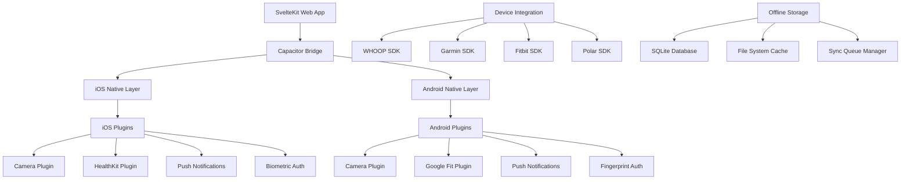
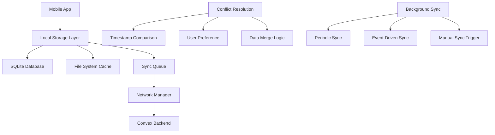

# Mobile App Deployment & Core Features Design

## Overview

The Technically Fit mobile applications will be built using Capacitor to provide native iOS and Android experiences while leveraging the existing SvelteKit web application. The design emphasizes native device integration, offline functionality, performance optimization, and seamless synchronization with the web platform. The apps will provide full feature parity with enhanced mobile-specific capabilities including camera access, health data integration, push notifications, and biometric authentication.

## Architecture

### Mobile App Architecture



### Data Synchronization Architecture



## Components and Interfaces

### 1. Capacitor Configuration (`capacitor.config.ts`)

**Purpose**: Configure Capacitor for iOS and Android deployment

**Configuration**:

```typescript
interface CapacitorConfig {
  appId: "com.example.technicallyfit";
  appName: "Technically Fit";
  webDir: "dist";
  server: {
    androidScheme: "https";
  };
  plugins: {
    Camera: {
      permissions: ["camera"];
    };
    PushNotifications: {
      presentationOptions: ["badge", "sound", "alert"];
    };
    CapacitorHealthkit: {
      permissions: ["steps", "heartRate", "sleep", "workouts"];
    };
  };
}
```

### 2. Native Plugin Manager (`$lib/mobile/nativePluginManager.ts`)

**Purpose**: Manage all native plugin interactions and capabilities

**Key Methods**:

```typescript
interface NativePluginManager {
  initializePlugins(): Promise<void>;
  checkPermissions(plugin: string): Promise<PermissionStatus>;
  requestPermissions(plugin: string): Promise<PermissionResult>;
  isNativeFeatureAvailable(feature: string): Promise<boolean>;
  handlePluginError(plugin: string, error: any): Promise<void>;
  getDeviceInfo(): Promise<DeviceInfo>;
  getPlatformCapabilities(): Promise<PlatformCapabilities>;
}
```

### 3. Camera Service (`$lib/mobile/cameraService.ts`)

**Purpose**: Handle camera access for barcode scanning and photo capture

**Key Methods**:

```typescript
interface CameraService {
  initializeCamera(): Promise<void>;
  startBarcodeScanning(): Promise<string>;
  stopBarcodeScanning(): void;
  capturePhoto(options: PhotoOptions): Promise<Photo>;
  toggleFlashlight(): Promise<void>;
  checkCameraPermissions(): Promise<PermissionStatus>;
  requestCameraPermissions(): Promise<PermissionResult>;
  handleCameraError(error: CameraError): Promise<void>;
}
```

### 4. Health Data Integration Service (`$lib/mobile/healthDataService.ts`)

**Purpose**: Integrate with device health platforms and wearables

**Key Methods**:

```typescript
interface HealthDataService {
  connectHealthKit(): Promise<HealthKitConnection>;
  connectGoogleFit(): Promise<GoogleFitConnection>;
  connectWHOOP(): Promise<WHOOPConnection>;
  syncHealthData(source: string, dataTypes: string[]): Promise<HealthDataSync>;
  getAvailableDataTypes(source: string): Promise<string[]>;
  requestHealthPermissions(dataTypes: string[]): Promise<PermissionResult>;
  disconnectHealthSource(source: string): Promise<void>;
}
```

### 5. Push Notification Service (`$lib/mobile/pushNotificationService.ts`)

**Purpose**: Handle push notifications and user engagement

**Key Methods**:

```typescript
interface PushNotificationService {
  initializePushNotifications(): Promise<void>;
  registerForNotifications(): Promise<string>;
  scheduleLocalNotification(notification: LocalNotification): Promise<void>;
  handleNotificationReceived(notification: PushNotification): Promise<void>;
  updateNotificationPreferences(
    preferences: NotificationPreferences
  ): Promise<void>;
  clearNotifications(): Promise<void>;
  getBadgeCount(): Promise<number>;
  setBadgeCount(count: number): Promise<void>;
}
```

### 6. Offline Storage Manager (`$lib/mobile/offlineStorageManager.ts`)

**Purpose**: Manage offline data storage and synchronization

**Key Methods**:

```typescript
interface OfflineStorageManager {
  initializeOfflineStorage(): Promise<void>;
  storeOfflineData(data: any, type: string): Promise<void>;
  getOfflineData(type: string, filters?: any): Promise<any[]>;
  queueSyncOperation(operation: SyncOperation): Promise<void>;
  processSyncQueue(): Promise<SyncResult[]>;
  resolveConflicts(conflicts: DataConflict[]): Promise<ConflictResolution[]>;
  clearOfflineData(type?: string): Promise<void>;
  getStorageUsage(): Promise<StorageUsage>;
}
```

### 7. Biometric Authentication Service (`$lib/mobile/biometricAuthService.ts`)

**Purpose**: Handle biometric authentication for secure app access

**Key Methods**:

```typescript
interface BiometricAuthService {
  isBiometricAvailable(): Promise<BiometricAvailability>;
  authenticateWithBiometric(): Promise<BiometricResult>;
  enableBiometricAuth(): Promise<void>;
  disableBiometricAuth(): Promise<void>;
  getBiometricType(): Promise<BiometricType>;
  handleBiometricError(error: BiometricError): Promise<void>;
  fallbackToPassword(): Promise<AuthResult>;
}
```

## Data Models

### Mobile-Specific Models

```typescript
interface DeviceInfo {
  platform: "ios" | "android";
  model: string;
  version: string;
  uuid: string;
  manufacturer: string;
  isVirtual: boolean;
  webViewVersion: string;
  capabilities: DeviceCapabilities;
}

interface DeviceCapabilities {
  camera: boolean;
  biometric: boolean;
  healthData: boolean;
  pushNotifications: boolean;
  backgroundSync: boolean;
  fileSystem: boolean;
  location: boolean;
}

interface OfflineData {
  id: string;
  type: "workout" | "nutrition" | "message" | "progress";
  data: any;
  timestamp: string;
  syncStatus: "pending" | "syncing" | "synced" | "failed";
  retryCount: number;
  lastSyncAttempt?: string;
}
```

### Health Data Models

```typescript
interface HealthDataConnection {
  source: "healthkit" | "googlefit" | "whoop" | "garmin" | "fitbit" | "polar";
  connected: boolean;
  permissions: string[];
  lastSync: string;
  availableDataTypes: string[];
  syncFrequency: "realtime" | "hourly" | "daily";
}

interface HealthDataPoint {
  source: string;
  type: "steps" | "heartRate" | "sleep" | "calories" | "distance" | "workouts";
  value: number;
  unit: string;
  timestamp: string;
  metadata?: any;
  quality: "high" | "medium" | "low";
}
```

### Notification Models

```typescript
interface PushNotification {
  id: string;
  title: string;
  body: string;
  data?: any;
  badge?: number;
  sound?: string;
  category?: string;
  threadId?: string;
  summaryArgument?: string;
}

interface LocalNotification {
  id: string;
  title: string;
  body: string;
  schedule: NotificationSchedule;
  sound?: string;
  badge?: number;
  data?: any;
}

interface NotificationPreferences {
  workoutReminders: boolean;
  nutritionReminders: boolean;
  trainerMessages: boolean;
  achievements: boolean;
  weeklyProgress: boolean;
  quietHours: {
    enabled: boolean;
    start: string;
    end: string;
  };
}
```

### Sync and Conflict Resolution

```typescript
interface SyncOperation {
  id: string;
  type: "create" | "update" | "delete";
  entity: string;
  data: any;
  timestamp: string;
  priority: "high" | "medium" | "low";
  retryCount: number;
  maxRetries: number;
}

interface DataConflict {
  id: string;
  entity: string;
  localData: any;
  serverData: any;
  conflictType: "timestamp" | "content" | "deletion";
  resolutionStrategy: "manual" | "automatic" | "merge";
}

interface ConflictResolution {
  conflictId: string;
  resolution: "local" | "server" | "merge" | "custom";
  resolvedData: any;
  timestamp: string;
}
```

## Platform-Specific Implementations

### iOS Implementation

```typescript
interface iOSSpecificFeatures {
  healthKit: {
    dataTypes: [
      "HKQuantityTypeIdentifierStepCount",
      "HKQuantityTypeIdentifierHeartRate",
    ];
    permissions: ["read", "write"];
    backgroundDelivery: boolean;
  };
  notifications: {
    categories: NotificationCategory[];
    actions: NotificationAction[];
    provisional: boolean;
  };
  biometric: {
    faceID: boolean;
    touchID: boolean;
    fallbackTitle: string;
  };
  backgroundModes: ["background-fetch", "background-processing"];
}
```

### Android Implementation

```typescript
interface AndroidSpecificFeatures {
  googleFit: {
    dataTypes: ["TYPE_STEP_COUNT_DELTA", "TYPE_HEART_RATE_BPM"];
    scopes: ["FITNESS_ACTIVITY_READ", "FITNESS_BODY_READ"];
    recordingApi: boolean;
  };
  notifications: {
    channels: NotificationChannel[];
    importance: "high" | "default" | "low";
    showBadge: boolean;
  };
  biometric: {
    fingerprint: boolean;
    face: boolean;
    iris: boolean;
  };
  backgroundWork: {
    workManager: boolean;
    foregroundService: boolean;
  };
}
```

## Performance Optimization

### App Launch Optimization

- **Lazy Loading** - Load screens and components on demand
- **Code Splitting** - Split JavaScript bundles for faster initial load
- **Asset Optimization** - Compress images and optimize fonts
- **Preloading** - Preload critical data during splash screen

### Memory Management

- **Component Cleanup** - Properly dispose of components and listeners
- **Image Caching** - Intelligent image caching with size limits
- **Data Pagination** - Load data in chunks to reduce memory usage
- **Background Cleanup** - Clean up resources when app is backgrounded

### Battery Optimization

- **Efficient Sync** - Batch network requests and sync operations
- **Background Limits** - Minimize background processing
- **Location Services** - Use location services efficiently
- **Screen Wake** - Prevent unnecessary screen wake events

### Network Optimization

- **Request Batching** - Combine multiple API requests
- **Caching Strategy** - Cache responses and use conditional requests
- **Compression** - Compress request and response data
- **Offline First** - Design for offline-first functionality

## Security Implementation

### Data Protection

```typescript
interface SecurityMeasures {
  encryption: {
    atRest: "AES-256";
    inTransit: "TLS 1.3";
    keyManagement: "device-keychain";
  };
  authentication: {
    biometric: boolean;
    pinCode: boolean;
    sessionTimeout: number;
  };
  privacy: {
    dataMinimization: boolean;
    consentManagement: boolean;
    rightToDelete: boolean;
  };
}
```

### Certificate Pinning

- **SSL Pinning** - Pin certificates for API endpoints
- **Public Key Pinning** - Pin public keys for additional security
- **Backup Pins** - Include backup pins for certificate rotation
- **Failure Handling** - Handle pinning failures gracefully

### Jailbreak/Root Detection

- **Detection Methods** - Multiple detection techniques
- **Graceful Degradation** - Reduce functionality on compromised devices
- **User Education** - Inform users about security risks
- **Bypass Prevention** - Implement anti-tampering measures

## Testing Strategy

### Unit Testing

- **Plugin Testing** - Test all native plugin integrations
- **Offline Testing** - Test offline functionality and sync
- **Performance Testing** - Test app performance and memory usage
- **Security Testing** - Test security measures and data protection

### Integration Testing

- **Device Testing** - Test on various iOS and Android devices
- **Health Data Testing** - Test health data integration with real devices
- **Notification Testing** - Test push and local notifications
- **Sync Testing** - Test data synchronization scenarios

### End-to-End Testing

- **User Journey Testing** - Test complete user workflows
- **Cross-Platform Testing** - Test feature parity between platforms
- **Offline/Online Testing** - Test transitions between connectivity states
- **Performance Testing** - Test app performance under various conditions

## Deployment and Distribution

### App Store Preparation

```typescript
interface AppStoreConfig {
  ios: {
    bundleId: "com.example.technicallyfit";
    version: string;
    buildNumber: string;
    certificates: string[];
    provisioningProfiles: string[];
    entitlements: string[];
  };
  android: {
    applicationId: "com.example.technicallyfit";
    versionCode: number;
    versionName: string;
    signingConfig: SigningConfig;
    permissions: string[];
  };
}
```

### CI/CD Pipeline

- **Automated Building** - Build apps for both platforms
- **Testing Integration** - Run tests before deployment
- **Code Signing** - Automatic code signing for distribution
- **Store Upload** - Automated upload to app stores

### Release Management

- **Staged Rollout** - Gradual release to users
- **A/B Testing** - Test features with subset of users
- **Rollback Strategy** - Quick rollback for critical issues
- **Update Notifications** - Notify users of important updates

## Monitoring and Analytics

### Performance Monitoring

- **Crash Reporting** - Comprehensive crash reporting and analysis
- **Performance Metrics** - Monitor app performance and user experience
- **Network Monitoring** - Track network usage and errors
- **Battery Usage** - Monitor battery impact and optimization

### User Analytics

- **Usage Tracking** - Track feature usage and user behavior
- **Conversion Funnels** - Monitor user journey and conversion rates
- **Retention Analysis** - Track user retention and engagement
- **Feature Adoption** - Monitor adoption of new features

### Business Intelligence

- **Revenue Tracking** - Track in-app purchases and subscriptions
- **User Segmentation** - Segment users by behavior and demographics
- **Cohort Analysis** - Analyze user cohorts and lifetime value
- **Competitive Analysis** - Monitor app store rankings and reviews
