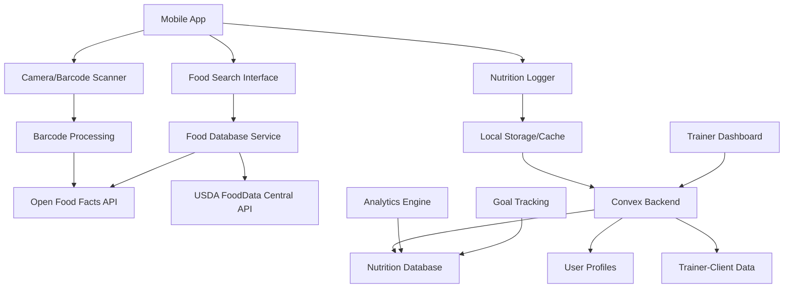

# Nutrition Tracking Design

## Overview

The Technically Fit nutrition tracking system will integrate multiple APIs (Open Food Facts, USDA FoodData Central) with native mobile barcode scanning capabilities to provide comprehensive food logging and nutrition analysis. The system will leverage the existing Convex backend for data storage and sync, while providing offline functionality through local caching. The design emphasizes user experience, data accuracy, and seamless integration with existing fitness tracking and trainer-client features.

## Architecture

### Nutrition System Architecture



### Component Architecture

```mermaid
graph TD
    A[Nutrition Components] --> B[BarcodeScanner]
    A --> C[FoodSearch]
    A --> D[FoodLogger]
    A --> E[NutritionDashboard]
    A --> F[MealPlanner]
    
    G[Nutrition Services] --> H[FoodDatabaseService]
    G --> I[BarcodeService]
    G --> J[NutritionCalculator]
    G --> K[OfflineManager]
    
    L[Data Layer] --> M[NutritionStore]
    L --> N[FoodCache]
    L --> O[SyncManager]
    
    P[API Integrations] --> Q[OpenFoodFactsAPI]
    P --> R[USDAFoodDataAPI]
    P --> S[ConvexNutritionAPI]
```



## Components and Interfaces

### 1. Food Database Service (`$lib/nutrition/foodDatabaseService.ts`)

**Purpose**: Central service for food data retrieval from multiple APIs

**Key Methods**:
```typescript
interface FoodDatabaseService {
  searchFoods(query: string, limit?: number): Promise<FoodSearchResult[]>
  getFoodByBarcode(barcode: string): Promise<FoodItem | null>
  getFoodDetails(foodId: string, source: 'openfoodfacts' | 'usda'): Promise<DetailedFoodItem>
  createCustomFood(foodData: CustomFoodData): Promise<FoodItem>
  getFavoritesFoods(userId: string): Promise<FoodItem[]>
  getRecentFoods(userId: string, limit?: number): Promise<FoodItem[]>
}
```

### 2. Barcode Scanner Service (`$lib/nutrition/barcodeService.ts`)

**Purpose**: Handle barcode scanning and processing

**Key Methods**:
```typescript
interface BarcodeService {
  initializeScanner(): Promise<void>
  startScanning(): Promise<string>
  stopScanning(): void
  processBarcode(barcode: string): Promise<FoodItem | null>
  enableFlashlight(): void
  disableFlashlight(): void
  validateBarcode(barcode: string): boolean
}
```

### 3. Nutrition Calculator (`$lib/nutrition/nutritionCalculator.ts`)

**Purpose**: Calculate nutrition values, goals, and recommendations

**Key Methods**:
```typescript
interface NutritionCalculator {
  calculateDailyTotals(foodEntries: FoodEntry[]): NutritionTotals
  calculateGoalProgress(totals: NutritionTotals, goals: NutritionGoals): GoalProgress
  calculateServingNutrition(food: FoodItem, quantity: number, unit: string): NutritionInfo
  recommendDailyGoals(user: User, fitnessGoals: FitnessGoal[]): NutritionGoals
  calculateMacroRatios(nutrition: NutritionInfo): MacroRatios
  suggestFoodsForGoals(remainingGoals: NutritionGoals): FoodSuggestion[]
}
```

### 3A. Weekly Macro Balancer (`$lib/nutrition/weeklyMacroBalancer.ts`)

**Purpose**: Handle adaptive weekly macro balancing and adjustments

**Key Methods**:
```typescript
interface WeeklyMacroBalancer {
  calculateWeeklyBalance(userId: string, weekStartDate: string): Promise<WeeklyMacroBalance>
  adjustRemainingDays(currentBalance: WeeklyMacroBalance, dayCompleted: string): Promise<NutritionGoals[]>
  suggestDailyAdjustments(overage: NutritionTotals, remainingDays: number, settings: AdjustmentSettings): NutritionGoals[]
  validateAdjustments(adjustments: NutritionGoals[], maxLimits: AdjustmentSettings): boolean
  applyUserFeedback(adjustmentId: string, accepted: boolean, modifications?: Partial<NutritionGoals>): Promise<void>
  resetWeeklyGoals(userId: string, newWeekStart: string): Promise<WeeklyMacroBalance>
  getBalanceRecommendations(weeklyHistory: WeeklyMacroBalance[]): GoalRecommendation[]
}
```

### 4. Offline Manager (`$lib/nutrition/offlineManager.ts`)

**Purpose**: Handle offline functionality and data synchronization

**Key Methods**:
```typescript
interface OfflineManager {
  cacheFood(food: FoodItem): Promise<void>
  getCachedFood(foodId: string): Promise<FoodItem | null>
  queueFoodEntry(entry: FoodEntry): Promise<void>
  syncPendingEntries(): Promise<SyncResult>
  isOnline(): boolean
  getPendingEntriesCount(): number
  clearCache(): Promise<void>
}
```

### 5. Nutrition Components

#### BarcodeScanner (`$lib/components/nutrition/BarcodeScanner.svelte`)
- Native camera integration
- Real-time barcode detection
- Flashlight controls
- Manual barcode entry fallback
- Scanning overlay and guidance

#### FoodSearch (`$lib/components/nutrition/FoodSearch.svelte`)
- Multi-API search interface
- Search result filtering and sorting
- Recent and favorite foods
- Custom food creation
- Nutrition preview cards

#### FoodLogger (`$lib/components/nutrition/FoodLogger.svelte`)
- Meal categorization (breakfast, lunch, dinner, snacks)
- Portion size selection
- Quick add from favorites
- Edit and delete entries
- Daily nutrition summary

#### NutritionDashboard (`$lib/components/nutrition/NutritionDashboard.svelte`)
- Daily nutrition overview
- Goal progress visualization
- Weekly/monthly trends
- Macro and micronutrient breakdowns
- Achievement badges and milestones

## Data Models

### Food Item Data
```typescript
interface FoodItem {
  id: string
  name: string
  brand?: string
  barcode?: string
  source: 'openfoodfacts' | 'usda' | 'custom'
  servingSizes: ServingSize[]
  nutrition: NutritionInfo
  ingredients?: string[]
  allergens?: string[]
  categories?: string[]
  imageUrl?: string
  verified: boolean
  createdAt: string
  updatedAt: string
}
```

### Nutrition Information
```typescript
interface NutritionInfo {
  calories: number
  protein: number // grams
  carbohydrates: number // grams
  fat: number // grams
  fiber: number // grams
  sugar: number // grams
  sodium: number // mg
  cholesterol: number // mg
  saturatedFat: number // grams
  transFat: number // grams
  vitamins?: VitaminInfo
  minerals?: MineralInfo
  servingSize: ServingSize
}
```

### Food Entry (User Log)
```typescript
interface FoodEntry {
  id: string
  userId: string
  foodId: string
  foodItem: FoodItem
  quantity: number
  servingSize: ServingSize
  mealType: 'breakfast' | 'lunch' | 'dinner' | 'snack'
  loggedAt: string
  nutrition: NutritionInfo // calculated for this entry
  notes?: string
  createdAt: string
}
```

### Nutrition Goals
```typescript
interface NutritionGoals {
  userId: string
  dailyCalories: number
  proteinGrams: number
  carbohydrateGrams: number
  fatGrams: number
  fiberGrams: number
  sodiumMg: number
  sugarGrams: number
  macroRatios: {
    proteinPercent: number
    carbPercent: number
    fatPercent: number
  }
  goalType: 'weight_loss' | 'muscle_gain' | 'maintenance' | 'endurance'
  createdAt: string
  updatedAt: string
}
```

### Weekly Macro Balance
```typescript
interface WeeklyMacroBalance {
  userId: string
  weekStartDate: string
  originalDailyGoals: NutritionGoals
  adjustedDailyGoals: { [date: string]: NutritionGoals }
  weeklyTargets: {
    totalCalories: number
    totalProtein: number
    totalCarbs: number
    totalFat: number
  }
  currentWeeklyTotals: {
    calories: number
    protein: number
    carbs: number
    fat: number
  }
  adjustmentSettings: {
    maxDailyIncrease: number // percentage, e.g., 20 for 20%
    maxDailyDecrease: number // percentage
    enableAutoAdjustment: boolean
    balancingStrategy: 'conservative' | 'moderate' | 'aggressive'
  }
  balanceHistory: MacroAdjustment[]
  createdAt: string
  updatedAt: string
}
```

### Macro Adjustment
```typescript
interface MacroAdjustment {
  date: string
  reason: 'overage' | 'shortage' | 'user_request'
  originalTargets: NutritionGoals
  adjustedTargets: NutritionGoals
  adjustmentAmounts: {
    caloriesDelta: number
    proteinDelta: number
    carbsDelta: number
    fatDelta: number
  }
  userAccepted: boolean
  appliedAt: string
}
```

### Meal Plan
```typescript
interface MealPlan {
  id: string
  userId: string
  name: string
  startDate: string
  endDate: string
  meals: PlannedMeal[]
  totalNutrition: NutritionInfo
  createdBy: string // userId or trainerId
  isTemplate: boolean
  createdAt: string
}
```

### Recipe
```typescript
interface Recipe {
  id: string
  userId: string
  name: string
  description?: string
  ingredients: RecipeIngredient[]
  instructions: string[]
  servings: number
  prepTime: number // minutes
  cookTime: number // minutes
  nutrition: NutritionInfo // per serving
  tags: string[]
  imageUrl?: string
  isPublic: boolean
  createdAt: string
}
```

## Error Handling

### API Error Types
```typescript
enum NutritionErrorType {
  FOOD_NOT_FOUND = 'food_not_found',
  BARCODE_INVALID = 'barcode_invalid',
  API_RATE_LIMIT = 'api_rate_limit',
  NETWORK_ERROR = 'network_error',
  CAMERA_PERMISSION = 'camera_permission',
  SCANNER_ERROR = 'scanner_error',
  SYNC_FAILED = 'sync_failed',
  INVALID_SERVING_SIZE = 'invalid_serving_size'
}
```

### Error Handling Strategy
1. **API Fallbacks** - Try Open Food Facts first, then USDA, then cached data
2. **Graceful Degradation** - Allow manual entry when APIs fail
3. **Offline Support** - Queue entries and sync when connection returns
4. **User Feedback** - Clear error messages with suggested actions
5. **Retry Logic** - Automatic retry for transient failures

### Camera and Scanning Errors
- **Permission Denied** - Guide user to enable camera permissions
- **Scanner Initialization Failed** - Provide manual barcode entry
- **Poor Lighting** - Suggest using flashlight or better lighting
- **Barcode Not Found** - Allow manual food entry with barcode saved

## Testing Strategy

### Unit Tests
- Food database service methods
- Nutrition calculation accuracy
- Barcode validation and processing
- Offline sync logic
- Goal progress calculations

### Integration Tests
- API integration with Open Food Facts and USDA
- Barcode scanning with real products
- Offline/online sync scenarios
- Cross-device data synchronization
- Trainer-client data sharing

### Mobile Testing
- Camera integration on iOS and Android
- Barcode scanning in various lighting conditions
- Offline functionality testing
- Performance with large food databases
- Battery usage optimization

### Nutrition Data Accuracy
- Verify nutrition calculations against known values
- Test serving size conversions
- Validate macro ratio calculations
- Cross-reference API data accuracy

## Security and Privacy

### Data Protection
- **Encryption** - Encrypt sensitive nutrition data at rest
- **Access Controls** - Role-based access for trainer-client data
- **Data Minimization** - Only collect necessary nutrition information
- **User Consent** - Explicit consent for data sharing with trainers

### API Security
- **Rate Limiting** - Implement client-side rate limiting for APIs
- **API Key Management** - Secure storage of API credentials
- **Request Validation** - Validate all API requests and responses
- **Error Logging** - Log errors without exposing sensitive data

### Privacy Controls
- **Granular Sharing** - Users control what nutrition data trainers can see
- **Data Export** - Allow users to export their nutrition data
- **Data Deletion** - Complete removal of nutrition data on request
- **Anonymization** - Remove personal identifiers from analytics data

## Performance Optimization

### Caching Strategy
- **Food Database Cache** - Cache frequently accessed foods locally
- **Image Caching** - Cache food images for offline viewing
- **Search Results Cache** - Cache recent search results
- **User Preferences Cache** - Cache favorite foods and recent entries

### Database Optimization
- **Indexed Queries** - Optimize nutrition data queries with proper indexing
- **Data Pagination** - Paginate large food search results
- **Batch Operations** - Batch multiple food entries for efficiency
- **Background Sync** - Sync nutrition data in background

### Mobile Performance
- **Lazy Loading** - Load nutrition data as needed
- **Image Optimization** - Compress and resize food images
- **Memory Management** - Efficient memory usage for large food databases
- **Battery Optimization** - Minimize camera and GPS usage

## Integration Points

### Convex Backend Integration
- **Nutrition Schema** - Extend existing schema with nutrition tables
- **User Integration** - Link nutrition data to existing user profiles
- **Trainer Access** - Integrate with existing trainer-client relationships
- **Sync Functions** - Real-time sync of nutrition data across devices

### Fitness Integration
- **Goal Alignment** - Align nutrition goals with fitness objectives
- **Calorie Adjustment** - Adjust nutrition targets based on workout calories
- **Performance Correlation** - Track nutrition impact on workout performance
- **Recovery Nutrition** - Suggest post-workout nutrition based on training

### Mobile App Integration
- **Camera API** - Native camera integration for barcode scanning
- **Push Notifications** - Remind users to log meals and track progress
- **Widget Support** - Quick nutrition logging from home screen widgets
- **Health App Sync** - Sync with Apple Health and Google Fit

### Third-Party Integrations
- **Fitness Trackers** - Import calorie burn data for nutrition adjustments
- **Meal Delivery Services** - Integration with meal kit providers
- **Grocery Apps** - Shopping list generation from meal plans
- **Recipe Platforms** - Import recipes from popular cooking apps

## Analytics and Insights

### Nutrition Analytics
- **Trend Analysis** - Track nutrition trends over time
- **Goal Achievement** - Monitor progress toward nutrition goals
- **Macro Balance** - Analyze macronutrient distribution
- **Micronutrient Gaps** - Identify potential nutritional deficiencies

### Behavioral Insights
- **Eating Patterns** - Identify meal timing and frequency patterns
- **Food Preferences** - Track most frequently consumed foods
- **Goal Adherence** - Measure consistency in meeting nutrition goals
- **Seasonal Trends** - Analyze how nutrition changes throughout the year

### Trainer Analytics
- **Client Progress** - Track client nutrition goal achievement
- **Intervention Effectiveness** - Measure impact of nutrition coaching
- **Compliance Monitoring** - Monitor client adherence to nutrition plans
- **Outcome Correlation** - Correlate nutrition with fitness results