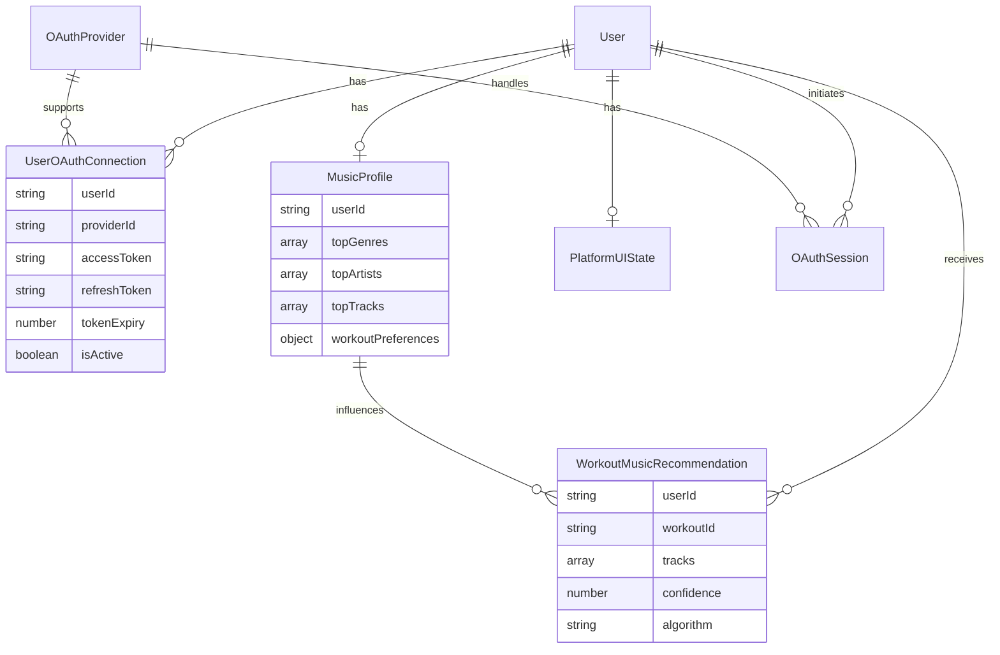

# Data Model: OAuth Implementation & Platform-Specific UI

## Overview
This document defines the data entities and schemas required for OAuth integration with music streaming platforms and platform-specific UI components.

## Core Entities

### OAuthProvider
Defines supported OAuth providers and their configuration.

```typescript
interface OAuthProvider {
  id: string; // 'spotify' | 'apple_music' | 'youtube_music'
  name: string;
  displayName: string;
  scopes: string[];
  authEndpoint: string;
  tokenEndpoint: string;
  redirectUri: string;
  clientId: string; // Environment-specific
  isEnabled: boolean;
  supportedPlatforms: Platform[];
  iconUrl?: string;
  brandColor?: string;
}
```

### UserOAuthConnection
Tracks user's OAuth connections to music platforms.

```typescript
interface UserOAuthConnection {
  _id: Id<"userOAuthConnections">;
  userId: Id<"users">;
  providerId: string; // References OAuthProvider.id
  accessToken: string; // Encrypted
  refreshToken?: string; // Encrypted
  tokenExpiry: number; // Unix timestamp
  scopes: string[];
  isActive: boolean;
  lastSyncAt?: number;
  createdAt: number;
  updatedAt: number;
  
  // Provider-specific user info
  externalUserId: string;
  displayName?: string;
  email?: string;
  profileImageUrl?: string;
  
  // Connection health
  lastErrorAt?: number;
  lastErrorMessage?: string;
  retryCount: number;
}
```

### MusicProfile
User's music preferences and listening data from connected platforms.

```typescript
interface MusicProfile {
  _id: Id<"musicProfiles">;
  userId: Id<"users">;
  
  // Aggregated data from all connected platforms
  topGenres: Genre[];
  topArtists: Artist[];
  topTracks: Track[];
  
  // Workout music preferences
  workoutGenres: string[];
  energyRange: {
    min: number; // 0-1 scale
    max: number;
  };
  tempoRange: {
    min: number; // BPM
    max: number;
  };
  
  // Platform-specific data
  platformData: {
    [providerId: string]: {
      playlists: Playlist[];
      recentTracks: Track[];
      lastUpdated: number;
    };
  };
  
  lastUpdated: number;
}

interface Genre {
  name: string;
  confidence: number; // 0-1 how strongly user likes this genre
  workoutSuitability: number; // 0-1 how good for workouts
}

interface Artist {
  id: string;
  name: string;
  imageUrl?: string;
  genres: string[];
  popularity: number;
  energy: number; // 0-1 scale
}

interface Track {
  id: string;
  name: string;
  artist: string;
  album?: string;
  durationMs: number;
  energy: number; // 0-1 scale
  tempo: number; // BPM
  danceability: number; // 0-1 scale
  valence: number; // 0-1 positivity scale
  imageUrl?: string;
  previewUrl?: string;
  externalUrls: {
    [platform: string]: string;
  };
}

interface Playlist {
  id: string;
  name: string;
  description?: string;
  imageUrl?: string;
  trackCount: number;
  isPublic: boolean;
  owner: string;
  externalUrl: string;
}
```

### WorkoutMusicRecommendation
AI-generated music recommendations for workouts.

```typescript
interface WorkoutMusicRecommendation {
  _id: Id<"workoutMusicRecommendations">;
  userId: Id<"users">;
  workoutId?: Id<"workouts">; // Optional link to specific workout
  
  // Recommendation context
  workoutType: string; // 'cardio' | 'strength' | 'yoga' | 'hiit' | etc.
  targetIntensity: number; // 0-1 scale
  duration: number; // minutes
  
  // Recommended tracks
  tracks: RecommendedTrack[];
  
  // Recommendation metadata
  generatedAt: number;
  algorithm: string; // Which AI model generated this
  confidence: number; // 0-1 how confident the AI is
  
  // User feedback
  rating?: number; // 1-5 stars
  feedback?: string;
  usedInWorkout: boolean;
}

interface RecommendedTrack extends Track {
  recommendationScore: number; // 0-1 why this was recommended
  reasoning: string; // AI explanation
  position: number; // Order in playlist (1-based)
  phaseMatch: 'warmup' | 'main' | 'cooldown';
}
```

### PlatformUIState
Manages platform-specific UI states and preferences.

```typescript
interface PlatformUIState {
  _id: Id<"platformUIStates">;
  userId: Id<"users">;
  platform: Platform;
  deviceInfo: DeviceInfo;
  
  // UI Preferences
  theme: 'light' | 'dark' | 'system';
  colorScheme: string;
  fontSize: 'small' | 'medium' | 'large';
  animations: boolean;
  hapticFeedback: boolean;
  
  // Layout preferences
  homeScreenLayout: string[]; // Widget order
  workoutScreenLayout: string[]; // Component visibility
  
  // Platform-specific settings
  iosSettings?: {
    useSystemColors: boolean;
    preferLargeText: boolean;
    voiceOverOptimized: boolean;
  };
  
  androidSettings?: {
    materialYou: boolean;
    adaptiveIcons: boolean;
    edgeToEdge: boolean;
  };
  
  webSettings?: {
    keyboardShortcuts: boolean;
    desktopNotifications: boolean;
    fullscreenMode: boolean;
  };
  
  lastUpdated: number;
}

type Platform = 'ios' | 'android' | 'web';

interface DeviceInfo {
  platform: Platform;
  version: string;
  model?: string;
  screenSize: {
    width: number;
    height: number;
    density: number;
  };
  capabilities: {
    hasNotch: boolean;
    hasHomeIndicator: boolean;
    supportsDarkMode: boolean;
    supportsHaptics: boolean;
  };
}
```

### OAuthSession
Temporary session data during OAuth flow.

```typescript
interface OAuthSession {
  _id: Id<"oauthSessions">;
  userId: Id<"users">;
  providerId: string;
  
  // PKCE flow data
  codeVerifier: string; // Encrypted
  codeChallenge: string;
  state: string;
  nonce: string;
  
  // Session metadata
  createdAt: number;
  expiresAt: number;
  redirectUri: string;
  scopes: string[];
  
  // Flow tracking
  status: 'initiated' | 'authorized' | 'completed' | 'error';
  errorMessage?: string;
  
  // Platform context
  platform: Platform;
  userAgent?: string;
  ipAddress?: string; // Hashed for security
}
```

## Data Relationships



## Encryption & Security

### Sensitive Data Handling
- All OAuth tokens stored encrypted using AES-256-GCM
- Encryption keys managed through environment variables
- PKCE code verifiers encrypted in temporary sessions
- IP addresses stored as SHA-256 hashes for privacy

### Data Retention
- OAuth sessions expire after 1 hour
- Expired tokens automatically cleaned up daily
- User data deletion includes all related OAuth connections
- Music profile data refreshed weekly from active connections

## Migration Strategy

### Phase 1: Core OAuth
1. Create base schemas for OAuthProvider, UserOAuthConnection, OAuthSession
2. Implement encryption utilities for sensitive fields
3. Set up automatic cleanup jobs for expired sessions

### Phase 2: Music Integration
1. Add MusicProfile and related schemas
2. Implement data sync from Spotify/Apple Music APIs  
3. Create recommendation engine schemas

### Phase 3: Platform UI
1. Add PlatformUIState schema
2. Implement device capability detection
3. Build platform-specific preference management

## Performance Considerations

### Indexing Strategy
```typescript
// Convex indexes for optimal query performance
const indexes = [
  // OAuth lookups
  ['userId', 'providerId'], // UserOAuthConnection
  ['providerId', 'isActive'], // Active connections by provider
  
  // Music data
  ['userId'], // MusicProfile lookup
  ['userId', 'workoutType'], // Workout recommendations
  
  // UI state
  ['userId', 'platform'], // Platform-specific settings
  
  // Sessions
  ['state'], // OAuth callback lookup
  ['expiresAt'], // Cleanup job queries
];
```

### Caching Strategy
- Music profile data cached for 1 hour
- UI preferences cached locally with sync
- OAuth tokens cached securely in memory
- Track metadata cached for 24 hours

This data model provides the foundation for secure OAuth integration, comprehensive music preference tracking, and platform-optimized UI management while maintaining strong privacy and security standards.